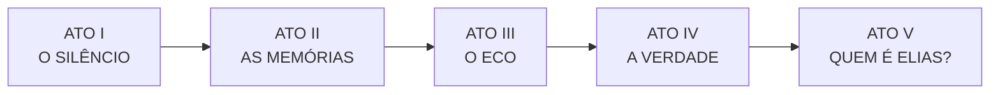

# 🕯️ BLACK VEIL — Documento de Conceito

> [!IMPORTANT] Documento superado
> O documento-base de produção passou a ser **[[01_BlackVeil_GDD|BLACK VEIL — Game Design Document]]**.
> Este arquivo permanece como registro do conceito original. Onde houver divergência, **o GDD prevalece**:
> idade de Elias (34), setores da AURORA-9 (A–G), nome da empresa (MNEMOS BIOTECH) e ano (2038).

> *"Algumas coisas não deveriam ter sido lembradas."*

**Gênero**: Survival horror psicológico
**Status**: Conceito — título provisório
**Registrado em**: 05/09/2026

---

## 1. Posicionamento

Um survival horror que persegue **a experiência** de Resident Evil sem herdar **nada do seu conteúdo**.

A decisão de partida é deliberada: não começar pela história de RE, e sim pelos princípios que
tornam o gênero funcional. O que se aproveita é a gramática do medo; o universo é inteiramente
próprio.

### O que se herda (a sensação)

| | |
| :--- | :--- |
| Exploração de espaço fechado | Recursos escassos |
| Puzzles integrados ao ambiente | Investigação por documentos e pistas |
| Criaturas com comportamento distinto | Perseguição |
| Chefes | Múltiplos finais |
| Protagonista vulnerável | Ameaça que escala continuamente |

### O que se substitui integralmente

| Resident Evil | BLACK VEIL |
| :--- | :--- |
| Vírus | **Organismo neural** |
| Zumbi | **Hospedeiro / Echo** |
| Umbrella | **Mnemos Corporation** |
| B.O.W. | **Entidades** |
| Infecção | **Assimilação** |
| Mutação física | **Mutação + memória** |
| Laboratório | **Aurora-9** |
| Protagonista policial / agente | **Técnico de segurança** |
| Vírus controla o corpo | **ECHO altera a memória** |
| Apocalipse biológico | **Colapso da identidade** |

> **A tese do projeto**: a memória como eixo permite terror físico, terror psicológico, puzzles
> e narrativa em um só sistema — sem depender de zumbis.

---

## 2. MNEMOS — a tecnologia

A Mnemos Corporation desenvolveu uma tecnologia capaz de **armazenar e reconstruir memórias
humanas**.

O propósito declarado era médico: recuperar memórias de pacientes com Alzheimer, traumas
cerebrais e perda de identidade.

Durante os testes, os cientistas descobriram duas coisas que não deveriam ser possíveis:

1. **Memórias podem existir fora do cérebro.**
2. **Memórias podem ser transferidas para outras pessoas.**

---

## 3. ECHO — a ameaça

Não é um vírus. É um **organismo neural artificial**.

**Capacidades:**
- Copiar padrões neurais
- Armazenar memórias
- Reproduzir vozes
- Imitar comportamentos
- Alterar percepções
- Influenciar sonhos
- Assumir parcialmente funções cerebrais

**O efeito colateral:** ao absorver memórias em volume suficiente, o ECHO começa a construir
**uma personalidade própria**.

---

## 4. O momento que define o tom

O protagonista entra em um hospital abandonado. Encontra uma mulher sentada em uma sala.
Ela parece perfeitamente normal.

> — Você demorou.
>
> — Quem é você?
>
> — Você não lembra de mim?

Ele não conhece aquela mulher. Mas ela começa a falar sobre coisas que **somente o protagonista
deveria saber**.

A cena não entrega uma resposta. Entrega três perguntas, e nenhuma delas é confortável:

- Ela está infectada?
- Ela realmente conhece o protagonista?
- **As memórias dele foram alteradas?**

Este é o registro emocional que o jogo inteiro deve sustentar: a ameaça não é ser atacado —
é não poder confiar no próprio passado.

---

## 5. Bestiário

O ECHO não produz um tipo único de criatura. **A forma depende das memórias absorvidas.**

### The Mimic
Copia aparência e voz de pessoas que encontrou.

**O problema de design que isso cria:** o jogador nunca sabe se um NPC encontrado antes ainda é
humano. Contamina retroativamente toda interação amistosa do jogo.

### The Collector
Obcecada por objetos — fotos, brinquedos, documentos, roupas, celulares — porque carregam
ligação emocional com memórias humanas.

**Progressão:** o jogador a encontra várias vezes ao longo do jogo, e ela fica mais inteligente
a cada encontro.

### The Witness
Não tem olhos. Não enxerga.

Percebe **memórias recentes**: se o jogador acabou de atravessar um corredor, ela consegue "ver"
esse acontecimento.

**Consequência mecânica:** inverte o stealth tradicional. Não basta não ser visto — é preciso
considerar o rastro do que se acabou de fazer.

### The Choir
Várias pessoas assimiladas, conectadas entre si, falando simultaneamente.

> — Ele está aqui.
> — Não.
> — Atrás da porta.

O jogador não sabe qual delas está falando com ele — nem se alguma está.

---

## 6. AURORA-9 — o cenário

Uma instalação de pesquisa de grande porte, construída **dentro de uma montanha**.

Deliberadamente **não** é uma mansão, uma delegacia, uma vila medieval nem um laboratório
subterrâneo genérico.

| Setor | Função | Papel narrativo |
| :---: | :--- | :--- |
| **A** | Hospital | Onde os testes começaram |
| **B** | Neurociência | Laboratórios |
| **C** | Arquivo | Milhares de memórias humanas armazenadas |
| **D** | Habitação | Funcionários e famílias |
| **E** | Contenção | Pacientes considerados perigosos |
| **F** | Núcleo | O verdadeiro propósito do projeto |

O Setor D é o que dá peso ao resto: havia **famílias** morando ali.

---

## 7. Elias Voss — protagonista

**32 anos. Técnico de manutenção especializado em sistemas de segurança.**

Recebe uma transmissão:

> *"AURORA-9 sofreu uma falha de contenção."*

É enviado para verificar o problema.

**O detalhe que sustenta o jogo inteiro:** Elias já esteve naquela instalação. Ele não lembra.

A escolha da profissão é funcional — um técnico de segurança tem razão plausível para acessar
terminais, portas e câmeras, sem precisar ser um combatente treinado. **Mantém o protagonista
vulnerável.**

---

## 8. Estrutura narrativa

### ATO I — O SILÊNCIO
Elias chega. Instalação aparentemente abandonada. Poucos corpos. Energia parcialmente
funcionando. Primeiros sinais de criaturas.

### ATO II — AS MEMÓRIAS
Elias encontra gravações. Descobre que os funcionários **o conheciam**. Ele não se lembra de
nenhum deles.

### ATO III — O ECO
Descobrimos que algumas criaturas possuem memórias humanas. Uma delas reconhece Elias — e o
**chama pelo nome**.

### ATO IV — A VERDADE
Elias descobre que participou **voluntariamente** do projeto. Suas memórias foram apagadas.

### ATO V — QUEM É ELIAS?
A revelação final. Talvez ele seja realmente humano. Talvez seja uma reconstrução. Talvez seja
uma cópia. **O jogador precisa descobrir.**

### O mistério de fundo
A empresa afirma que o MNEMOS foi criado para preservar a humanidade. Isso é apenas
parcialmente verdade.

O objetivo real era **criar uma consciência humana artificial** — uma inteligência construída a
partir de milhares de memórias humanas.

E ela já está acordada.

---

## 9. Os quatro finais

| # | Final | Desfecho |
| :-: | :--- | :--- |
| 1 | **HUMANIDADE** | Elias destrói o núcleo. A instalação é destruída. |
| 2 | **ASCENSÃO** | Elias aceita o ECHO. Abandona o corpo. A consciência passa para a rede. |
| 3 | **LOOP** | Elias descobre que tudo já aconteceu. Ele destruiu a instalação várias vezes. E sempre volta. |
| 4 | **VERDADE** | O personagem controlado durante todo o jogo **não é Elias**. É uma reconstrução criada pelo ECHO. |

---

## 10. Pilares de gameplay

### Inventário limitado
O jogador escolhe constantemente: munição ou medicamento? ferramenta ou arma? bateria ou chave?

### Terminais de Memória (save)
O progresso é salvo em terminais — mas **cada save também altera o estado das memórias
armazenadas**, e isso influencia determinados eventos.

O ato de salvar deixa de ser neutro. É diegético e tem custo.

### Iluminação que assusta o jogador
A lanterna tem bateria limitada — mas o diferencial é outro:

**Algumas criaturas não aparecem no escuro. Aparecem apenas quando iluminadas.**

O jogador passa a ter medo da própria lanterna. A ferramenta de segurança vira fonte de ameaça.

### Puzzles de memória
Nada de chave azul → porta azul.

Exemplo: uma sala contém 5 fotografias, 3 gravações e 4 documentos. O jogador precisa descobrir
**qual memória pertence a qual pessoa**.

Se errar, algo muda no ambiente.

### Sanidade ≠ barra de vida
Não existe medidor. **O mundo é que se altera.**

O jogador entra numa sala, sai, volta cinco minutos depois — a cadeira mudou de lugar.

> *"Eu que estou ficando louco?"*

Então ele encontra uma câmera que grava aquela sala. E na gravação, a cadeira **realmente estava
naquele lugar**.

Este é o pilar mais forte do conceito: a dúvida é verificável, e a verificação piora a dúvida.

---

## 11. Próximo passo — mapeamento para plugins

> Seção deliberadamente vazia. A decisão sobre quais plugins servem BLACK VEIL vem **depois**
> deste documento, para que a arquitetura sirva ao jogo e não o contrário.

### ⚠️ Observação a considerar antes desse mapeamento

O Sandbox Framework foi construído ao longo de 134 fases em torno de um eixo bastante diferente:
automação industrial, redes elétricas, tubulações, esteiras, mineração, veículos terrestres,
embarcações, aeronaves, espaçonaves 6-DOF, mechas, agricultura e ecologia planetária.

BLACK VEIL pede o oposto disso: **espaço único e fechado, recursos escassos, protagonista sem
poder, progressão por informação em vez de por construção**.

Há sobreposição real e aproveitável — inventário com peso e escolha, interação e puzzles,
persistência de estado do mundo, IA com StateTree e percepção, sistema de trauma/biomedicina,
save com integridade, UI e HUD, atmosfera e iluminação.

E há uma porção grande do framework que provavelmente **não** serve a este jogo.

Vale decidir explicitamente, no mapeamento, entre:

1. **BLACK VEIL usa um subconjunto do framework** — mantendo o resto desativado via
   `USBSandboxFeatureSubsystem` (a infraestrutura de features já existe para isso).
2. **BLACK VEIL é o produto e o framework se reorienta** — fases futuras passam a servir survival
   horror em vez de automação industrial.

São caminhos diferentes, e a escolha muda o roadmap inteiro.

---

## 📎 Nota de registro

Este documento consolida o conceito conforme especificado pelo usuário em 05/09/2026.

O arquivo de referência sobre Resident Evil mencionado na conversa **não estava disponível nesta
sessão** — nada aqui foi derivado dele. Todo o conteúdo veio do conceito descrito diretamente.
