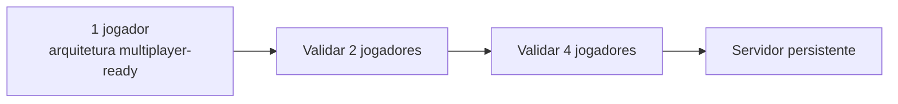

# 🌐 BLACK VEIL — Camada Online

> Extensão oficial do [[01_BlackVeil_GDD|GDD]] e da [[02_BlackVeil_Survival|camada Survival]].
> Multiplayer como **decisão de arquitetura desde o primeiro protótipo**, não como adição futura.

**Registrado em**: 05/09/2026

---

## 1. A decisão de partida

A documentação da Epic recomenda planejar multiplayer desde o início, porque converter um jogo
single-player para rede depois costuma exigir refatoração estrutural.

> [!TIP] Esta preocupação **não se aplica ao nosso caso** — e isso é uma vantagem rara
> O Sandbox Framework foi construído sob o **Princípio 8 do manifesto — "Multiplayer Ready"**:
> *"Toda lógica de gameplay, modificação de atributos e ativação de habilidades deve ser pensada
> para ambientes em rede com replicação apropriada, priorizando o controle do Servidor."*
>
> Verificação no código em 05/09/2026 — ver §11. A fundação de rede **já existe**.

Ainda assim, a ordem de desenvolvimento recomendada permanece incremental:
**1 jogador → validar 2 → validar 4 → só então servidor persistente.**

---

## 2. Modos de jogo

| Modo | Jogadores | Objetivo |
| :--- | :---: | :--- |
| **Story** | 1 | Campanha principal |
| **Co-op** | 2–4 | Campanha cooperativa |
| **Survival** | 1–4 | Sobreviver, explorar e construir |
| **Survival Online** | 2–8 | Servidor persistente |
| **Hardcore** | 1–4 | Morte permanente, recursos extremamente escassos |

**Identidade do projeto:** Survival Horror Online para 1–4 jogadores, com servidor dedicado
opcional para o Survival, mantendo a campanha **totalmente jogável solo**.

## 3. Papéis, não classes

Quatro jogadores entram na AURORA-9 com especializações — **sem classes rígidas**:

| Papel | Foco |
| :--- | :--- |
| **Médico** | Enfermaria, trauma, contaminação |
| **Engenheiro** | Energia, oficina, construção |
| **Segurança** | Combate, portas, defesa |
| **Explorador** | Superfície, recursos, rotas |

Especialização deve criar **interdependência**, não travar o jogador fora de uma mecânica.

---

## 4. 🎭 O diferencial — ECHO contra os jogadores

O multiplayer não é *"4 jogadores atirando em monstros"*.

O ECHO analisa as memórias dos jogadores. E então **começa a imitar um deles**.

> João está com você. Vocês entram numa sala.
>
> — Vou verificar aquela porta.
>
> Ele desaparece.
>
> Trinta segundos depois, João volta.
>
> Só que não é João. É o Mimic.
>
> **E o jogo não avisa.**

O jogador precisa perceber por conta própria: comportamento estranho · voz · equipamento ·
movimentos · pequenas inconsistências.

> Esta é a mecânica que **só existe em multiplayer** — e provavelmente a mais forte de todo o
> projeto. A paranoia deixa de ser tema e vira sistema, porque o objeto da desconfiança é uma
> pessoa real.

### ⚠️ Restrição técnica que isso impõe
O Mimic **não pode ser distinguível pelos dados de rede**. Se ele for uma classe de ator
diferente, ou tiver `PlayerState` ausente, um cliente modificado detecta a fraude trivialmente e
a mecânica morre.

Consequência de arquitetura: a imitação precisa ser **autoritativa no servidor**, com o cliente
recebendo a mesma silhueta de dados que receberia do jogador real. Isso precisa ser decidido
**antes** de implementar, não depois.

---

## 5. Servidor persistente

```
                 BLACK VEIL ONLINE
                        │
                 DEDICATED SERVER
        ┌───────────────┼───────────────┐
      Player 1        Player 2        Player 3
        └───────────────┼───────────────┘
                        │
                  WORLD STATE
       ┌────────────────┼────────────────┐
    Recursos          Bases          Criaturas
    Eventos          Energia         Bosses
```

| Topologia | Uso |
| :--- | :--- |
| **Dedicated Server** | Survival persistente |
| **Listen Server** | Co-op simples da campanha |

## 6. Base compartilhada

```
AURORA-9 SURVIVAL BASE
┌──────────────────────────┐
│ 🔫 Arsenal   🧪 Laboratório │
│ 🛠️ Oficina   💊 Enfermaria │
│ 📦 Armazém   ⚡ Gerador     │
└──────────────────────────┘
```

**A base pode ser atacada — e não necessariamente por hordas:**

> 02:37. O gerador desliga. As câmeras param.
>
> Um jogador está dormindo na base. Outro está explorando.
>
> E então a porta do laboratório abre sozinha.

O ataque à base é um **evento de horror**, não um wave defense. Cabe ao `HorrorDirector`
orquestrar — e o fato de um jogador estar longe e outro perto é exatamente o insumo que ele usa.

## 7. Bosses no online

### THE CHOIR — o exemplo mais forte
| Contexto | Comportamento |
| :--- | :--- |
| Single-player | Consciência compartilhada entre corpos assimilados |
| **Multiplayer** | **Começa a copiar os jogadores** |

Você encontra João, Maria, Pedro e Lucas. **Um deles é falso.**

O boss reproduz nome · skin · voz · arma · comportamento.

Os demais bosses ganham as manifestações já previstas em [[02_BlackVeil_Survival]] §17 —
The Warden em apagões, The Mimic infiltrado entre sobreviventes.

## 8. Morte e MEMORY RECOVERY

Estado progressivo, sem perda total obrigatória:

```
Ferido → Incapacitado → (outro jogador pode reviver) → Morto
```

### A mecânica de assinatura
Quando um jogador morre, parte da memória dele fica registrada pelo ECHO. Outro jogador pode
encontrar:

```
MEMORY FRAGMENT — PLAYER 02
```

E recuperar: **localização · últimos itens · últimas ações · últimas palavras.**

> Até a morte vira parte da narrativa — e o corpo de um companheiro passa a ser uma fonte de
> informação, não só um saco de loot.

## 9. Campanha e Survival como o mesmo mundo

Story Mode e Survival Online **não precisam ser mundos separados**.

| Camada | Quem você é |
| :--- | :--- |
| **Campanha** | Elias Voss |
| **Survival** | Seu próprio sobrevivente |
| **Online** | Sobreviventes tentando descobrir o que aconteceu com Elias |

Acontecimentos da campanha podem afetar o Survival:

> *"O Núcleo ECHO foi destruído."*
>
> Mas no Survival, **ninguém sabe se isso realmente aconteceu.**

> Esta é a melhor costura possível entre os modos, porque a incerteza é **tematicamente correta**
> num jogo sobre memória não confiável. A ambiguidade não é limitação técnica disfarçada — é o
> assunto do jogo.

---

## 10. Estrutura de pastas (multiplayer-ready desde o início)

```
BLACKVEIL
├── Core          ├── Memory        ├── Multiplayer
├── Characters    ├── ECHO          │   ├── Sessions
├── AI            ├── HorrorDirector│   ├── Replication
├── Combat        ├── Narrative     │   ├── PlayerState
├── Inventory     ├── Quests        │   ├── GameState
├── Survival      ├── World         │   ├── Server
├── Crafting      ├── Bosses        │   └── Persistence
├── Building      ├── Creatures     ├── UI
├── Vehicles      └── Audio
```

---

# 11. 🎯 O que a fundação de rede já entrega

Verificação no código real em 05/09/2026.

| Recurso | Situação |
| :--- | :--- |
| **Princípio 8 — Multiplayer Ready** | Regra fundadora do framework, não retrofit |
| Componentes com `GetLifetimeReplicatedProps` | **12** |
| Propriedades `Replicated` / `ReplicatedUsing` | **24** |
| RPCs `Server` / `Client` / `NetMulticast` | **18** |
| Implementações de `_Validate` (validação de RPC) | **19** |
| Compensação de latência | `USBLagCompensationSubsystem` |
| Limitação de taxa de RPC | `USBRPCRateLimiter` |
| Movimentação preditiva com rollback de rede | `USBMovementComponent` (`TG_PrePhysics`) |
| Replicação condicional de atributos (público/privado) | `USBAttributeComponent` |
| Guardas de race condition em loot disputado | `USBInventoryComponent` |
| Filtro anti-spill em split-screen | `USBUserWidget` |
| Anti-cheat com rollback em vez de kick | Documentado no manifesto §E |
| Tokens de realocação autorizada (teleporte legítimo) | `AuthorizeServerRelocation` |

### Doutrina de anti-cheat já estabelecida
O manifesto §E define a severidade que o online deve seguir:

- **`_Validate`** → falha indica pacote manipulado → **desconexão imediata**
- **Movimento** → nunca desconecta por lag → **rollback via `TeleportTo`** para a última posição
  autorizada
- **Tolerância de 150 unidades** em interações é compromisso deliberado com latência real

> Isso significa que a decisão mais cara do multiplayer — **o que fazer quando o cliente mente** —
> já foi tomada e implementada.

## 12. O que NÃO existe para o online

| Necessidade | Situação |
| :--- | :--- |
| **Sessões e matchmaking** | ❌ Não existe |
| **Persistência de servidor dedicado** | ⚠️ Parcial — `USBSaveSubsystemConcrete` é save local criptografado e assinado, não estado de servidor compartilhado. O modelo de persistência por GUID (`USBSandboxPersistenceSubsystem`) é reaproveitável, a camada de servidor não. |
| **Imitação de jogador pelo Mimic** | ❌ Não existe — e impõe a restrição de §4 |
| **Reprodução de voz de jogador** | ❌ Não existe — ver ressalva abaixo |
| **`MEMORY RECOVERY` de jogador morto** | ❌ Não existe |
| **Replicação do `HorrorDirector`** | ❌ Não existe (o sistema em si também não) |

### ⚠️ Ressalva sobre imitação de voz
Reproduzir a voz de um jogador real implica capturar áudio de voice chat. Isso levanta questões
de consentimento, privacidade e classificação etária que não são técnicas.

Alternativa mais segura e provavelmente igualmente eficaz: o Mimic reproduz **texto, callouts do
jogo e padrões de comportamento** — não a voz capturada. A inconsistência que denuncia a fraude
continua existindo, sem o problema legal.

---

## 13. Ordem de desenvolvimento recomendada



A UE permite testar sessões multiplayer localmente durante o desenvolvimento (Play As
Client / número de jogadores no editor), então a validação em 2 e 4 não exige infraestrutura.

**Regra de ouro desta camada:** nenhuma mecânica nova entra sem que se responda *"como isso
replica?"* — a fundação existe justamente para que essa pergunta tenha resposta barata.

---

## 14. Próximo passo

O **Documento de Produção do Vertical Slice** ([[01_BlackVeil_GDD]] §54) deve agora especificar
o slice já em modo **Listen Server com 2 jogadores**, ainda que a experiência-alvo seja solo.

Validar rede no slice custa pouco e elimina a única categoria de risco que este projeto ainda
não neutralizou.
