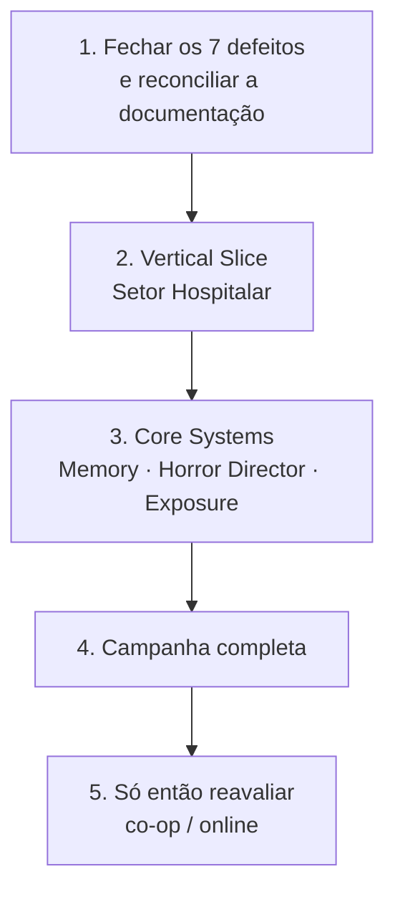

# 🧭 BLACK VEIL — Decisão de Direção

> Documento de decisão. Registra **uma escolha**, o raciocínio que a sustenta e os pontos em que
> ela pode estar errada.

**Decidido em**: 05/09/2026
**Solicitado por**: usuário — *"tome a decisão da melhor direção para o projeto, sempre levando em
consideração a premissa base do projeto"*

---

## ⚖️ A DECISÃO

> **BLACK VEIL é um survival horror narrativo single-player.**
>
> A camada de sobrevivência é adotada, mas **subordinada ao horror**.
> A arquitetura permanece multiplayer-ready. **O online não entra no escopo de lançamento.**
> O alvo imediato e único é o **Vertical Slice do Setor Hospitalar**.

| Camada | Decisão |
| :--- | :--- |
| **Campanha narrativa** | ✅ **É o produto.** Espinha dorsal, 10 capítulos, 6 bosses, 4 finais |
| **Sobrevivência** | ✅ **Adotada e subordinada** — serve ao ritmo do horror, não a si mesma |
| **Mundo semiaberto** | ⚠️ **Reduzido** — superfície existe, mas contida (ver §4) |
| **Construção de base** | ⚠️ **Reduzida** — abrigo funcional, não engenharia livre |
| **Co-op** | ❌ **Fora do lançamento** |
| **Survival Online 2–8** | ❌ **Fora do lançamento** |
| **Arquitetura de rede** | ✅ **Mantida** — já existe e é gratuita preservar |

---

## 1. Por que o online fica de fora

### 1.1 O argumento decisivo: a fantasia central de BLACK VEIL é epistemicamente solo

O jogo se sustenta sobre uma pergunta:

> *"Posso confiar na minha própria percepção?"*

Toda mecânica de assinatura serve a ela — a sanidade sem barra, a cadeira que muda de lugar, a
câmera que confirma o impossível, a narrativa não confiável, o Ato V perguntando quem é Elias.

**Um segundo jogador é uma verificação de realidade.** No instante em que alguém pode dizer
*"eu também vi"* ou *"a cadeira sempre esteve aí"*, a dúvida deixa de ser interna e vira fato
consultável. O sistema mais forte do jogo é desarmado pela presença de uma testemunha.

Isso não é um problema de implementação. É incompatibilidade de premissa.

### 1.2 O Mimic multiplayer é excelente — e é de outro jogo

A ideia do ECHO imitando um jogador real é a melhor deste conjunto de documentos. Mas ela produz
**paranoia social** — desconfiar de outra pessoa.

BLACK VEIL trata de **paranoia epistêmica** — desconfiar de si mesmo.

São dois horrores diferentes, e o social é mais fácil e mais barulhento. Colocados juntos, o
social vence: é imediato, gera reação e conversa. O epistêmico exige silêncio e solidão para
funcionar.

> **Recomendação:** preservar a ideia. Ela não morre — ela espera. É material de forte
> potencial para BLACK VEIL II, um spin-off cooperativo, ou um modo pós-lançamento **depois**
> que a identidade do jogo estiver estabelecida.

### 1.3 Horror coletivo tem meia-vida curta

Co-op reduz medo. Jogadores conversam, se coordenam, riem. Os grandes sucessos de horror
cooperativo funcionam por serem sociais e leves — não por serem assustadores. BLACK VEIL não é
esse produto.

### 1.4 O custo real não é técnico

A fundação de rede existe ([[03_BlackVeil_Online]] §11) e essa parte de fato sairia barata.

O caro é o resto: sessões, matchmaking, persistência de servidor, operação contínua, QA
multiplicado por número de jogadores, anti-cheat em operação, e a pesquisa de mascaramento
autoritativo que o Mimic exige para não ser detectável por cliente modificado.

Nada disso existe. E nada disso torna o jogo mais assustador.

---

## 2. Por que a sobrevivência **fica** — mas subordinada

### 2.1 O argumento a favor é forte

A verificação em [[02_BlackVeil_Survival]] §20 mostrou que o framework **já implementa**
metabolismo, térmica, trauma, imunidade, exposição, construção, crafting, rede elétrica, clima,
persistência e simulação de mundo. Descartar isso seria jogar fora a maior vantagem do projeto.

E a sobrevivência serve ao horror de forma direta: **o lugar seguro não tem comida.** O jogador é
obrigado a sair. Essa é uma das melhores razões de design deste documento.

### 2.2 Mas existe um risco real que precisa ser nomeado

> **Maestria de sobrevivência é inimiga do horror.**

O arco de um survival sandbox aponta para competência: base montada, estoque cheio, rota
conhecida, rotina segura. O arco do horror aponta para vulnerabilidade crescente.

Eles puxam em direções opostas. É por isso que praticamente todo survival com terror deixa de
assustar por volta da terceira hora — não porque o conteúdo acaba, mas porque o jogador venceu o
sistema.

### 2.3 O projeto já tem os antídotos — e eles viram regra

Duas mecânicas já desenhadas atacam exatamente esse problema, e por isso passam a ser
**obrigatórias, não opcionais**:

| Antídoto | Efeito |
| :--- | :--- |
| **Base grande atrai criaturas** ([[02_BlackVeil_Survival]] §5) | Progressão aumenta capacidade **e** risco juntos. Impede que o late game vire seguro. |
| **Exposição alta revela memórias** ([[02_BlackVeil_Survival]] §13) | Único sistema em que jogar "mal" é estratégia. Impede otimização em direção ao conforto. |

**Critério de aceitação para qualquer mecânica de sobrevivência daqui em diante:**

> Ela cria decisão sob pressão, ou vira manutenção que o jogador domina e esquece?
> Se for a segunda, está fora.

---

## 3. Por que a arquitetura multiplayer permanece

Preservar não custa nada — já está construído e testado. Remover custaria trabalho e destruiria
opção futura.

**Regra prática:** todo sistema novo (`MemorySystem`, `HorrorDirector`, `ExposureSystem`) deve
ser escrito respeitando autoridade de servidor e replicação, como manda o **Princípio 8** do
manifesto.

Isso mantém a porta aberta para co-op ou online no futuro **sem** pagar hoje o custo de
desenvolvê-los, testá-los e operá-los.

---

## 4. O mundo semiaberto encolhe

A superfície florestal permanece — ela justifica a saída em busca de recursos e cria o contraste
dia/noite. Mas **contida**: rotas desenhadas, não território livre.

Razão: mapa aberto grande multiplica custo de arte, IA, navegação e teste, e **dilui** densidade
de horror. Corredor assusta; campo aberto não.

Mesma lógica para construção: **abrigo funcional** (parede, porta, fogueira, baú, bancada,
gerador, enfermaria) em pontos definidos — não engenharia livre em qualquer lugar.

---

## 5. 🚨 A razão operacional que pesa mais que todas

Este projeto tem um **padrão documentado de declarar concluído o que nunca foi verificado**:

| Declarado | Real |
| :--- | :--- |
| "Fase 134 concluída" | Nenhum arquivo das Fases 121–134 estava na árvore de compilação |
| "450 specs 100% verdes" | 221 specs existem; 14 falhavam; nada disso jamais compilou |
| "322 / 394 / 450 specs" | Três documentos, três números, nenhum medido |

Ver [[../Sandbox_Framework/audit_report_conformidade_2026-09-05|relatório de auditoria]].

A trajetória de escopo desta conversa — *survival horror linear* → *+ survival sandbox* →
*+ online persistente 2–8 jogadores* — aconteceu em duas mensagens, **antes de existir um único
minuto jogável**.

> É exatamente o mesmo mecanismo que produziu 134 fases fantasma: **escopo declarado crescendo
> mais rápido que entrega verificada.**

A decisão de cortar o online não é sobre o online ser ruim. É sobre **restaurar a proporção entre
o que se afirma e o que se comprova** — que é a premissa que este projeto mais precisa recuperar.

---

## 6. Sequência decidida

### Passo 1 — Fechar o que está aberto *(antes de qualquer conteúdo novo)*
7 defeitos remanescentes · reconciliar números de spec · sincronizar GAS → V1.
**Motivo:** é o passo que quebra o padrão descrito em §5. Não há trabalho novo confiável sobre
base não verificada.

### Passo 2 — Vertical Slice, single-player
Setor Hospitalar · 15–30 min · Elias · Hollow · The Surgeon · puzzle elétrico · Memory Echo ·
encerramento em `SUBJECT 07`.

**Critério de sucesso — um só:** alguém que nunca viu o projeto joga e **sente medo**.
Não "os sistemas funcionam". Medo.

### Passo 3 — Core Systems
`MemorySystem`, `HorrorDirector`, `ExposureSystem` — os únicos sistemas que o framework não tem
e que definem a identidade do jogo.

### Passo 4 — Campanha

### Passo 5 — Reavaliar online
Com jogo pronto, identidade estabelecida e público real, a pergunta muda de *"dá para fazer?"*
para *"vale a pena?"* — que é a pergunta certa.

---

## 7. 🤔 Onde esta decisão pode estar errada

Registrado deliberadamente, para poder ser contestado com argumento e não com opinião.

**1. Co-op horror vende.** Phasmophobia e Lethal Company são sucessos enormes. Minha resposta é
que ambos são jogos sociais de reação, não horror psicológico narrativo — mas se o objetivo
comercial for alcance e não a experiência descrita no GDD, **a decisão muda**, e essa é uma
escolha legítima de negócio que não me cabe.

**2. A ideia do Mimic multiplayer é boa demais para adiar.** É a mecânica mais original de todo o
material. Adiá-la tem custo real de oportunidade. Mantenho a recomendação porque ela serve a um
horror diferente do que o GDD descreve — mas reconheço que é o ponto mais discutível.

**3. Cortar escopo pode desmotivar.** Escopo grande anima. Se a motivação do projeto depende da
ambição declarada, cortar pode custar mais do que ganha. É uma variável humana que eu não tenho
como avaliar daqui.

**4. Meu julgamento sobre "maestria mata horror" é uma generalização.** É bem sustentada, mas
BLACK VEIL tem antídotos desenhados que talvez a superem. Se o Vertical Slice mostrar que a
sobrevivência **aumenta** a tensão em vez de diluí-la, a §4 (encolher o mundo aberto) deve ser
revista.

---

## 8. O que NÃO muda

Nada do que foi registrado é descartado. [[02_BlackVeil_Survival]] e [[03_BlackVeil_Online]]
permanecem válidos como **projeto de futuro**, não como escopo de lançamento.

O mapeamento para o framework (§20 de `02_`) e a fundação de rede (§11 de `03_`) continuam sendo
as duas descobertas mais valiosas deste conjunto — e é justamente porque essa base existe que
**adiar o online não custa nada**.
