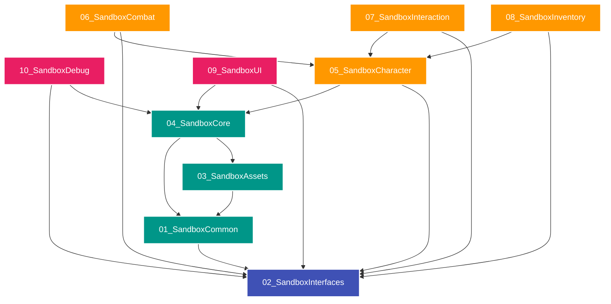

# 🎮 Sandbox Framework - Painel de Controle (Dashboard)

Bem-vindo ao painel central do **Sandbox Framework** no seu Obsidian. Este espaço centraliza o planejamento, padrões de arquitetura, manuais de uso e histórico de desenvolvimento dos projetos localizados em `D:\Unreal\V1` e integrado no projeto de animações em `D:\Unreal\GameAnimationSample`.

---

## 🚀 Status do Projeto

- **Projeto Primário**: `D:\Unreal\V1` (Sandbox Framework C++ standalone)
- **Integração Híbrida**: `D:\Unreal\GameAnimationSample` (Game Animation Sample com Sandbox C++)
- **Repositório GitHub**: [GameAnimationSampleSandbox-Framework](https://github.com/JoaoSantosCodes/GameAnimationSampleSandbox-Framework)
- **Fase Atual**: `Fase 31 Concluída` — **Inteligência Artificial Integrada com State Component**
- **Suíte de Testes**: **100% Verde (56/56 Specs Passando em ambos os projetos)**
- **Versão de Lançamento**: `v1.17.0` (Tabela de Agro, tags de bloqueio CC de movimento/armas e testes)

---

## 🗺️ Navegação Rápida (Documentos e Notas)

Use os links abaixo para navegar pelas notas e especificações de design do framework diretamente no Obsidian:

*   📋 **CHECKLIST & TAREFAS**: [[task|Checklist de Atividades e Fases]]
*   🚀 **HISTÓRICO DE ENTREGAS**: [[walkthrough|Walkthrough de Refatorações e Recursos]]
*   📜 **DIRETRIZES DE ARQUITETURA**: [[manifesto_and_coding_standards|Manifesto & Padrões de Código C++]]
*   📐 **ESPECIFICAÇÕES TÉCNICAS**: [[sfps_specification|Especificação Estrutural (SFPS v1.0.0)]]
*   📘 **MANUAL DO DESENVOLVEDOR**: [[sfdg_guide|Guia de Desenvolvimento (SFDG v1.0.0)]]
*   📘 **MANUAL DE USO DO PRODUTO**: [[manual_de_uso|Manual de Utilização do Framework]]
*   🧪 **BATERIA DE TESTES**: [[bateria_de_testes|Guia da Bateria de Testes Automatizados]]

---

## 🗂️ Estrutura Física de Diretórios (`D:\Unreal\V1`)

Os plugins físicos e suas dependências unidirecionais estão estruturados da seguinte forma:



---

## 🛠️ Comandos de Terminal Recomendados

### Projeto Standalone (V1)
*   **Compilar Editor**:
    ```powershell
    dotnet "C:\Program Files\Epic Games\UE_5.8\Engine\Binaries\DotNET\UnrealBuildTool\UnrealBuildTool.dll" V1Editor Win64 Development "D:\Unreal\V1\V1.uproject" -waitmutex
    ```
*   **Rodar Testes**:
    ```powershell
    & "C:\Program Files\Epic Games\UE_5.8\Engine\Binaries\Win64\UnrealEditor-Cmd.exe" "D:\Unreal\V1\V1.uproject" -NullRHI -NoSound -NoSplash -stdout -ExecCmds="Automation RunTest Sandbox; Quit" -log
    ```

### Projeto de Integração (GameAnimationSample)
*   **Compilar Editor**:
    ```powershell
    dotnet "C:\Program Files\Epic Games\UE_5.8\Engine\Binaries\DotNET\UnrealBuildTool\UnrealBuildTool.dll" GameAnimationSampleEditor Win64 Development "D:\Unreal\GameAnimationSample\GameAnimationSample.uproject" -waitmutex
    ```
*   **Rodar Testes**:
    ```powershell
    & "C:\Program Files\Epic Games\UE_5.8\Engine\Binaries\Win64\UnrealEditor-Cmd.exe" "D:\Unreal\GameAnimationSample\GameAnimationSample.uproject" -NullRHI -NoSound -NoSplash -stdout -ExecCmds="Automation RunTest Sandbox; Quit" -log
    ```

