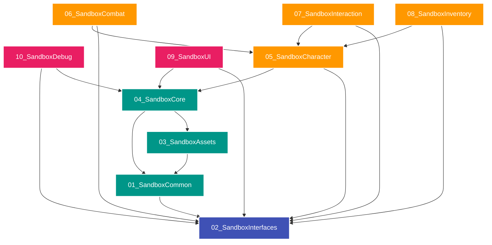

# 🎮 Sandbox Framework - Painel de Controle (Dashboard)

Bem-vindo ao painel central do **Sandbox Framework** no seu Obsidian. Este espaço centraliza o planejamento, padrões de arquitetura, manuais de uso e histórico de desenvolvimento do projeto em `D:\Unreal\GameAnimationSample`.

---

## 🚀 Status do Projeto

- **Projeto Único**: `D:\Unreal\GameAnimationSample` (Game Animation Sample com o Sandbox Framework em C++)
- **Repositório GitHub**: [GameAnimationSampleSandbox-Framework](https://github.com/JoaoSantosCodes/GameAnimationSampleSandbox-Framework)
- **Fase Atual**: `Fase 102 Concluída` — **Power Grid, Generators, Batteries, Circuit Wiring & Electric Consumers Framework (v1.87.0)**
- **Suíte de Testes**: **444 de 444 specs verdes — EXIT CODE: 0** (medido em `D:\Unreal\GameAnimationSample` em 06/09/2026 via `Automation RunTest Sandbox`)
- **Versão de Lançamento**: `v1.87.0` (Redes elétricas, balanço de geração vs consumo, baterias acumuladoras, proteção contra sobrecarga/blackout, integridade estrutural e colapso físico, maquinário pesado hidráulico, mechas bípedes, espaçonaves 6-DOF orbitais, aeronaves atmosféricas, embarcações náuticas, veículos terrestres, parkour e combate avançado)

> [!WARNING] O número 322 declarado aqui até 06/09/2026 nunca foi medido
> A auditoria de 05/09/2026 encontrou quatro números divergentes na documentação (322, 322, 394 e 450), nenhum deles obtido rodando a suíte. O valor acima é o único medido.
>
> **O workspace `D:\Unreal\V1` foi excluído pelo usuário e não existe mais.** Menções a ele em documentos históricos (`walkthrough.md`, `task.md`, relatório de auditoria) são registro de um estado passado e ficaram preservadas como tal; não há projeto secundário a sincronizar nem a homologar.

---

## 🗺️ Navegação Rápida (Documentos e Notas)

Use os links abaixo para navegar pelas notas e especificações de design do framework diretamente no Obsidian:

*   📋 **CHECKLIST & TAREFAS**: [[task|Checklist de Atividades e Fases]]
*   🚀 **HISTÓRICO DE ENTREGAS**: [[walkthrough|Walkthrough de Refatorações e Recursos]]
*   📊 **STATUS ATUAL DO PROJETO**: [[status_atual_do_projeto|Status Atual e Métricas]]
*   📜 **DIRETRIZES DE ARQUITETURA**: [[manifesto_and_coding_standards|Manifesto & Padrões de Código C++]]
*   📐 **ESPECIFICAÇÕES TÉCNICAS**: [[sfps_specification|Especificação Estrutural (SFPS v1.0.0)]]
*   📘 **MANUAL DO DESENVOLVEDOR**: [[sfdg_guide|Guia de Desenvolvimento (SFDG v1.0.0)]]
*   📘 **MANUAL DE USO DO PRODUTO**: [[manual_de_uso|Manual de Utilização do Framework]]
*   🧪 **BATERIA DE TESTES**: [[bateria_de_testes|Guia da Bateria de Testes Automatizados]]
*   ⏳ **LINHA DO TEMPO & ROADMAP**: [[linha_do_tempo_e_roadmap|Roadmap e Linha do Tempo Expandida]]

---

## 🗂️ Estrutura Física de Diretórios (`D:\Unreal\GameAnimationSample`)

Os plugins físicos e suas dependências unidirecionais estão estruturados da seguinte forma:



---

## 🛠️ Comandos de Terminal Recomendados

> [!IMPORTANT] A engine deste projeto é a de `D:\Unreal\Unreal Sistema\UE_5.8`, não a do launcher
> As duas instalações existem na máquina. O `.uproject` referencia a engine por `EngineAssociation` em GUID, e o log confirma `Base Directory: D:/Unreal/Unreal Sistema/UE_5.8/`. Comandos apontados para `C:\Program Files\Epic Games\UE_5.8` compilam contra a engine errada.

*   **Compilar Editor**:
    ```powershell
    & "D:\Unreal\Unreal Sistema\UE_5.8\Engine\Build\BatchFiles\Build.bat" GameAnimationSampleEditor Win64 Development -Project="D:\Unreal\GameAnimationSample\GameAnimationSample.uproject" -WaitMutex
    ```
*   **Rodar Testes**:
    ```powershell
    & "D:\Unreal\Unreal Sistema\UE_5.8\Engine\Binaries\Win64\UnrealEditor-Cmd.exe" "D:\Unreal\GameAnimationSample\GameAnimationSample.uproject" -NullRHI -NoSound -NoSplash -stdout -unattended -nopause -ExecCmds="Automation RunTest Sandbox; Quit" -log
    ```
