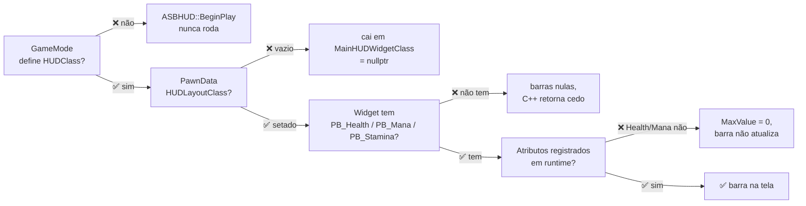

# 🛠️ Guia de Implementação — Fazer a HUD de Status Funcionar

**Para**: você, no Unreal Editor. Nada aqui pode ser feito por MCP — ver
[[mcp_playbook_unreal|playbook de MCP]] §2.5.
**Diagnóstico levantado em**: 06/09/2026, lendo o código-fonte e inspecionando os `.uasset`.
**Estado atual**: a HUD de status **não mostra nada em jogo, e nunca mostrou**.

---

## 1. Por que ela não funciona

Não é um defeito, são **quatro**, em série. Cada um sozinho já bastaria para a tela ficar vazia.



| # | Elo | Estado verificado | Onde |
| :-: | :--- | :--- | :--- |
| 1 | GameMode define `HUDClass = ASBHUD` | ❌ **Não** | `ASBGameMode` só define GameState, PlayerController e PlayerState. `BP_SBGameMode_Test` não referencia `SBHUD` |
| 2 | PawnData define `HUDLayoutClass` | ❌ **Vazio** | Nem `DA_HeroPawnData` nem `DA_HeroPawnDataV2` referenciam widget de HUD |
| 3 | Widget tem as três barras | ❌ **Nenhuma** | `USBStatusHUDWidget.uasset` não contém widget algum |
| 4 | Atributos existem em runtime | ⚠️ **Só Stamina** | Ver §6 — é o mais sutil |
| 5 | C++ lê e atualiza | ✅ **Pronto** | Lê por contrato a 30 Hz por timer, sem alocação |

> [!NOTE] Por que as barras são `OptionalWidget = true`
> ```cpp
> UPROPERTY(BlueprintReadOnly, meta = (BindWidget, OptionalWidget = true), Category = "Sandbox|UI")
> TObjectPtr<UProgressBar> PB_Health;
> ```
> Sendo opcionais, a ausência delas **não gera erro de compilação** no Blueprint. Foi por isso
> que o problema sobreviveu meses sem ser notado: nada reclama, a tela só fica vazia.

---

## 2. Ordem de execução

Faça na ordem. Cada passo tem verificação própria, e pular a verificação é como o projeto chegou
até aqui.

1. §3 — Barras no widget
2. §4 — PawnData aponta para o widget
3. §5 — GameMode usa o `ASBHUD`
4. §6 — Atributos registrados
5. §7 — Verificação de ponta a ponta

---

## 3. Passo 1 — Criar as barras no widget

**Asset**: `Content/SandboxFramework/Widgets/USBStatusHUDWidget`

1. Abra o asset (duplo clique). Ele abre no **UMG Designer**, com a hierarquia vazia.
2. Se não houver um **Canvas Panel** na raiz, arraste um da paleta para a hierarquia.
3. Arraste três **Progress Bar** da paleta para dentro do Canvas Panel.
4. Renomeie cada uma, no painel de hierarquia, para **exatamente**:

   | Nome | Sem espaço, sem sufixo, respeitando maiúsculas |
   | :--- | :--- |
   | `PB_Health` | |
   | `PB_Mana` | |
   | `PB_Stamina` | |

> [!DANGER] O nome é o contrato inteiro
> `meta = (BindWidget)` casa **por nome**. `PB_health`, `PB_Health_1` ou `PB Health` resultam em
> ponteiro nulo, e o C++ retorna cedo sem tocar na barra. Não há erro, log ou aviso — a barra
> simplesmente não se move.
>
> Se o UMG adicionar sufixo automático (`ProgressBar_0`), renomeie manualmente.

5. Posicione e dimensione como quiser. Sugestão para começar: ancoradas no canto superior
   esquerdo, 300×24 cada, empilhadas com 8 px de espaço.
6. Opcional, no painel Details de cada barra: **Fill Color and Opacity** — vermelho para vida,
   azul para mana, verde para estamina.
7. **Compile** e **Save**.

**Verificação**: com o widget selecionado na hierarquia, o painel **My Blueprint → Variables**
deve listar `PB_Health`, `PB_Mana` e `PB_Stamina` como variáveis herdadas do C++ (ícone de
cadeado). Se aparecerem como variáveis novas do Blueprint, o nome divergiu do C++.

> [!TIP] A taxa de atualização é ajustável
> No painel **Class Defaults** do widget existe `Resource Refresh Interval`, padrão `0.0333`
> (30 Hz). É a frequência com que o C++ relê os atributos. Não precisa mexer.

---

## 4. Passo 2 — Apontar o PawnData para o widget

**Asset**: `Content/SandboxFramework/Data/Pawn/DA_HeroPawnData` (e/ou `DA_HeroPawnDataV2`)

1. Abra o Data Asset.
2. Localize a categoria **UI**, propriedade **HUD Layout Class**.
3. Selecione o **Blueprint** `USBStatusHUDWidget` — não a classe C++.
4. **Save**.

> [!WARNING] Tem de ser o Blueprint, não a classe C++
> `USBStatusHUDWidget` é `UCLASS(Abstract)`. Uma classe abstrata não pode ser instanciada, e
> `CreateWidget` devolveria nulo. O dropdown pode oferecer as duas — escolha a que tem ícone de
> Blueprint.

**Verificação**: reabra o asset e confirme que o campo ficou preenchido. Se você editar o
`DA_HeroPawnDataV2`, confirme qual dos dois o personagem em uso realmente referencia.

---

## 5. Passo 3 — Fazer o GameMode usar o `ASBHUD`

Este é o elo que **nenhum** dos outros passos adianta sem ele: se `ASBHUD` não for instanciado,
`BeginPlay` não roda e nada lê o `HUDLayoutClass`.

`ASBGameMode` (C++) define `GameStateClass`, `PlayerControllerClass` e `PlayerStateClass` — mas
**não** `HUDClass`. O engine então usa `AHUD` puro.

**Asset**: `Content/SandboxFramework/Blueprints/BP_SBGameMode_Test`

1. Abra o Blueprint.
2. **Class Defaults** → categoria **Classes** → **HUD Class**.
3. Selecione **`SBHUD`**.
4. **Compile** e **Save**.

> [!IMPORTANT] Verifique também qual pawn este GameMode usa
> `BP_SBGameMode_Test` tem `DefaultPawnClass = /Game/Blueprints/SandboxCharacter_Mover_Ragdoll`
> — **não** é o `BP_SBCharacter_Hero`. Se esse pawn não for um `SBCharacter` com PawnData, a
> cadeia quebra no primeiro elo: `ASBHUD::BeginPlay` procura o PawnData **pelo pawn possuído**.
>
> ```cpp
> APawn* Pawn = PC->GetPawn();
> if (Pawn && Pawn->GetClass()->ImplementsInterface(USBCharacterInterface::StaticClass()))
> ```
>
> Se o pawn não implementar `ISBCharacterInterface`, o código cai direto em
> `MainHUDWidgetClass`, que é `nullptr` por padrão.

**Alternativa que dispensa o PawnData**: em vez de §4, defina **Main HUD Widget Class** no
próprio `BP_SBHUD` (crie um Blueprint derivado de `SBHUD` e use-o como HUD Class). É o caminho
de fallback do C++ e funciona independente do pawn.

---

## 6. Passo 4 — Garantir que os atributos existem

O mais sutil dos quatro, e o que mais provavelmente vai te confundir depois que os outros três
estiverem certos.

**`USBAttributeComponent` não registra atributo nenhum sozinho.** Não há lista editável de
atributos padrão; `OnInitialize_Implementation` é vazio. Os atributos aparecem só quando alguém
chama `RegisterAttribute`, e em produção quem chama é:

| Atributo | Quem registra |
| :--- | :--- |
| `Attribute.Stamina` | `USBMovementComponent::OnReady` |
| `Attribute.Weapon.Ammo` | `USBCombatComponent` |
| `Attribute.Weight`, `Attribute.MaxWeight` | `USBInventoryComponent` |
| **`Attribute.Health`** | **ninguém** |
| **`Attribute.MaxHealth`** | **ninguém** |
| **`Attribute.Mana`** | **ninguém** |

Consequência: mesmo com os passos 1–3 corretos, **só a barra de estamina se move**. As de vida e
mana ficam paradas, porque `GetAttributeMaxValue` devolve `0` e o C++ retorna cedo para evitar
divisão por zero:

```cpp
const float MaxValue = ISBAttributeComponentInterface::Execute_GetAttributeMaxValue(AttrComp, AttributeTag);
if (MaxValue <= 0.0f)
{
    return;   // barra intocada
}
```

**Duas formas de resolver:**

**(a) Por Blueprint** — no `BeginPlay` do seu personagem, chame `Register Attribute` (é
`BlueprintCallable`) três vezes:

| Attribute Tag | Base Value | Min Value | Max Value |
| :--- | :---: | :---: | :---: |
| `Attribute.MaxHealth` | 100 | 0 | 100 |
| `Attribute.Health` | 100 | 0 | 100 |
| `Attribute.Mana` | 50 | 0 | 50 |

**(b) Por C++** — o lugar coerente com o desenho do framework é o `ComponentSet`/PawnData
alimentar valores iniciais. Hoje não existe esse campo; adicioná-lo é mudança de código, não de
editor. Se quiser seguir por aí, me peça.

> [!NOTE] Por que a estamina funciona e as outras não
> `USBMovementComponent::OnReady` registra `Attribute.Stamina` lendo o `DA_MovementConfig`. É o
> único componente que traz seu atributo consigo. Vida e mana nunca tiveram dono.

---

## 7. Passo 5 — Verificação de ponta a ponta

Só depois dos quatro passos:

1. Abra o nível de teste e dê **Play**.
2. As três barras devem aparecer no canto escolhido.
3. **Corra** (Shift, ou o que estiver mapeado em `IA_SB_Sprint`). A barra de estamina deve
   **descer visivelmente** enquanto corre e **subir** ao parar, após o atraso de regeneração.

A estamina é o melhor teste porque é o único atributo que muda sozinho, todo frame, sem você
precisar causar dano ou gastar mana.

**Se nada aparecer**, diagnostique pelo log em vez de adivinhar — `Window → Output Log`, filtro
`LogSandboxUI`:

| Mensagem | Significado |
| :--- | :--- |
| `Successfully spawned HUD layout widget` | Passos 1–3 corretos; o problema é o §6 |
| *(nenhuma mensagem de `LogSandboxUI`)* | `ASBHUD::BeginPlay` não rodou → passo §5 |
| `No PawnData set on character X!` (`LogSandboxCharacter`) | O pawn não tem PawnData → §5, nota sobre `DefaultPawnClass` |

---

## 8. Armadilhas, em ordem de probabilidade

| # | Armadilha | Sintoma | Correção |
| :-: | :--- | :--- | :--- |
| 1 | Nome da barra divergente | Tela vazia, sem erro | §3 — os três nomes são exatos |
| 2 | `HUD Class` não setado | Nenhum log de `LogSandboxUI` | §5 |
| 3 | Pawn não é `SBCharacter` | HUD não aparece mesmo com tudo certo | §5, nota sobre `DefaultPawnClass` |
| 4 | Vida e mana paradas | Só a estamina se move | §6 |
| 5 | Escolheu a classe C++ e não o Blueprint | `CreateWidget` devolve nulo | §4 — a classe é `Abstract` |
| 6 | Editou o PawnData errado | Nada muda | Há dois: `DA_HeroPawnData` e `DA_HeroPawnDataV2` |
| 7 | Esqueceu de salvar | Funciona na sessão, some ao reabrir | Salve tudo ao fim |

---

## 9. O que **não** é problema seu

O lado C++ está pronto e verificado em 06/09/2026:

- Lê os três atributos por `ISBAttributeComponentInterface`, sem depender de
  `05_SandboxCharacter` — `09_SandboxUI` não pode depender dele.
- Atualiza por **timer de 30 Hz**, não por `NativeTick`. Isso é deliberado: `NativeTick` num
  widget de Blueprint só roda se `ClassRequiresNativeTick` estiver verdadeiro no `.uasset`, e
  essa flag é gravada em tempo de compilação do Blueprint. Um asset compilado antes de a classe
  C++ ganhar tick **nunca ticaria**, sem erro nem aviso.
- **Zero alocação por frame.** O caminho antigo alocava um `UObject` de payload por personagem
  por frame durante corrida e regeneração; hoje o evento `Event.Attribute.Changed` não tem
  assinante algum em produção.
- Coberto por `Sandbox.Character.AttributeContract` na suíte (446 specs verdes).

Se as barras não se moverem depois dos cinco passos, o defeito está em um dos elos acima — não
no C++.
