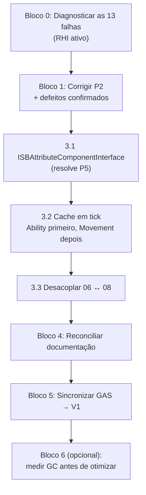

# 🗺️ Plano de Implementação — Resolução dos Pontos Abertos da Auditoria

**Origem**: [[audit_report_conformidade_2026-09-05|Relatório de Auditoria de 05/09/2026]]
**Workspace**: `D:\Unreal\GameAnimationSample` (ver [[audit_report_conformidade_2026-09-05|§ Workspace de trabalho]])
**Baseline medido**: build verde · **221 specs — 207 verdes, 14 vermelhas**
**Estado em 06/09/2026**: build verde · **444 specs — 444 verdes, EXIT CODE: 0**

> [!NOTE] Situação dos blocos em 06/09/2026
> | Bloco | Estado | Commit |
> | :--- | :--- | :--- |
> | 0 · Diagnóstico (P1) | ✅ Concluído — hipótese do `-NullRHI` refutada | — |
> | 1 · Correção de defeitos (P2 + os 13 do Bloco 0) | ✅ Concluído — suíte fechou em 444/444 | `b06d287` |
> | 3.1 · `ISBAttributeComponentInterface` (P5) | ✅ Concluído | `b06d287` |
> | 3.2 · Cache em tick (P3) | ✅ Concluído — 11 lookups viraram 3 | `16bcf75` |
> | 3.3 · Desacoplar 06 ↔ 08 (P4) | ✅ Concluído — produção sem `FindObject<UClass>` | `9a129dd` |
> | 4 · Documentação (P7) | 🟡 Números reconciliados; 3 decisões do usuário em aberto | — |
> | 5 · Sincronizar → V1 (P6) | ⏸ Desbloqueado, não iniciado | — |
> | 6 · Payloads por struct (P8) | ⏸ Opcional — medir GC antes | — |
>
> **Correções ao próprio plano, apuradas na execução:**
> 1. **`ISBResettable` não existe** neste workspace, nem pooling de atores. O plano tratava a invalidação de cache em `ResetState()` como a principal mitigação de risco do Bloco 3.2; o gancho não existe. `TWeakObjectPtr` com revalidação cobre o caso real (componente destruído em runtime).
> 2. **`ISBCombatantInterface` é contrato morto** — declarada em `02_SandboxInterfaces`, implementada por ninguém, e de nível de *ator*. O plano mandava "avaliar reuso"; não havia o que reusar. Criado `ISBCombatComponentInterface` seguindo a convenção de contratos de componente da própria auditoria.
> 3. **O `SBResourceNode` era pior que o inventariado** — não eram dois níveis de reflexão, eram três, incluindo leitura de `FProperty` por nome.
> 4. **Os 5 `FindObject<UClass>` de `SBInventoryTests.cpp` permanecem, deliberadamente.** O teste cobre a integração real entre os dois plugins pelo message router; um dublê apagaria a cobertura, e `NewObject` exige a classe concreta que um contrato não fornece. Não é violação do Princípio 4.

---

## 📌 Inventário dos Pontos Abertos

| # | Ponto | Origem | Tipo | Confirmado? |
| :-: | :--- | :--- | :--- | :--- |
| P1 | 13 falhas em Combat / AIBehavior / BackgroundSim | §11 | Diagnóstico | ❌ Causa desconhecida |
| P2 | `AtmosphericSafety` não aplica `ToxicInhalation` | §11 | Defeito | ✅ Confirmado |
| P3 | 4 lookups sem cache em `TickComponent` | §12.1 | Otimização | ✅ Confirmado |
| P4 | Acoplamento por string entre plugins irmãos | §12.2 | Arquitetura | ✅ Confirmado |
| P5 | `SBSandboxRuleSubsystem` resolve atributo por `ProcessEvent` | §3 | Arquitetura | ✅ Confirmado |
| P6 | V1 defasado — carrega todos os defeitos corrigidos aqui | §8 | Sincronização | ✅ Confirmado |
| P7 | Documentação declara 322/394/450 specs; real é 221 | §10 | Documentação | ✅ Confirmado |
| P8 | `SBEventSubsystem` aloca um `UObject` por evento | §5 | Otimização | ✅ Confirmado |

---

## ⚠️ Princípio Ordenador do Plano

> **P1 vem antes de tudo.** Enquanto não se souber se as 13 falhas são defeitos reais ou
> limitação do ambiente headless, não há como dimensionar o trabalho de correção. Um
> diagnóstico barato desbloqueia (ou elimina) o maior bloco de esforço do plano.

> **P6 vem por último, sempre.** Sincronizar para o V1 antes da suíte fechar verde propaga
> defeitos em vez de correções.

---

## 🔍 Bloco 0 — Diagnóstico (desbloqueia o restante)

### P1 · Classificar as 13 falhas de Combat / AI / BackgroundSim

**Hipótese a testar**: as falhas decorrem de `-NullRHI` headless, não de defeito de código.
A evidência circunstancial é que todas dependem de colisão, consulta espacial ou progressão
temporal (`HitTrace` retorna 0 acertos, `LockOn` não encontra alvo no cone frontal,
`MotionWarping` não translada, `SmartObjects` não reserva slot).

**Passos**
1. Reexecutar a suíte **com RHI ativo**, sem `-NullRHI`, restringindo ao escopo afetado para
   encurtar o ciclo:
   ```
   UnrealEditor-Cmd.exe "...\GameAnimationSample.uproject" -NoSound -NoSplash -stdout -unattended -nopause -ExecCmds="Automation RunTest Sandbox.Combat; Quit" -log
   ```
2. Comparar o conjunto de falhas com o baseline headless.
3. Classificar cada uma das 13 em **(a) defeito real** ou **(b) falso positivo de ambiente**.

### ✅ EXECUTADO em 05/09/2026 — hipótese REFUTADA

Suíte reexecutada com **RHI ativo** (D3D12 SM6 confirmado no log). Escopo
`Sandbox.Combat + Sandbox.AIBehavior + Sandbox.BackgroundSim`:
**55 verdes, 13 vermelhas — conjunto de falhas idêntico ao headless.**

O ambiente não era a causa. **As 13 são defeitos reais de lógica**, determinísticos e
aritméticos:

| Teste | Esperado | Obtido | Natureza |
| :--- | :---: | :---: | :--- |
| `MotionWarping` — alvo X | 200 | **0** | Cálculo de destino retorna zero |
| `MotionWarping` — meio do caminho | ~100 | **0** | idem |
| `MotionWarping` — posição final | 200 | **0** | idem |
| `PoiseAndSuperArmor` — regeneração | 80 | **60** | Taxa ou atraso de regen incorretos |
| `GameplayEffects` — stack +20 | 120 | **150** | Stacking acumula em excesso |
| `GameplayEffects` — stack +30 | 130 | **200** | idem |

**Consequência para o plano**: o Bloco 1 cresce de 1 para **14 defeitos**. Passa a ser o
maior bloco de esforço, e não mais uma nota de rodapé. As três falhas de `MotionWarping`
compartilham a mesma raiz (alvo = 0) e provavelmente se resolvem com uma correção; o mesmo
vale para as duas de `GameplayEffects`.

**Risco**: nenhum. Foi diagnóstico puro, sem alteração de código.

---

## 🐛 Bloco 1 — Correção de Defeitos

### P2 · `USBAtmosphericSafetyComponent` não transiciona para inalação tóxica

**Diagnóstico já estabelecido** (`SBAtmosphericSafetyTests.cpp`):

| Linha | Asserção | Resultado |
| :-: | :--- | :--- |
| 133 | `Filter exhausted delegate fired` | ✅ passa |
| 134 | `Has FilterExhausted tag` | ✅ passa |
| 135 | `Has ToxicInhalation tag` | ❌ **falha** |
| 136 | `In toxic inhalation state` | ❌ **falha** |

O componente esgota o filtro e emite o evento corretamente, mas não aplica
`State.Atmosphere.ToxicInhalation` nem entra no estado correspondente.

**Passos**
1. Ler `SimulateAtmosphereTick` em `SBAtmosphericSafetyComponent.cpp` e localizar o ramo que
   deveria disparar a inalação tóxica quando `ToxicGasPPM > limiar` **e** o filtro está esgotado.
2. Determinar se é (a) condição nunca satisfeita, (b) ordem de avaliação — a tag de exaustão
   sendo aplicada depois da checagem de toxicidade, ou (c) transição de estado ausente.
3. Corrigir aplicando a tag via `ISBStateComponentInterface` (padrão do framework).
4. Confirmar que os 4 asserts do teste passam.

**Risco**: baixo. Componente isolado, sem consumidores externos, com teste cobrindo.

### P1-derivado · Defeitos confirmados no Bloco 0

#### 🔁 Padrão recorrente identificado: "if/else excludente descarta o resto do tick"

Duas correções independentes revelaram **a mesma classe de defeito**. O código escreve:

```cpp
if (Contador > 0.0f) { Contador -= DeltaTime; }   // consome
else                 { AplicaEfeito(DeltaTime); } // aplica
```

Como os ramos são mutuamente exclusivos, o tick que **zera** o contador não aplica nada, e o
tempo excedente daquele tick é descartado. O efeito só começa no tick seguinte.

| Ocorrência | Sintoma | Estado |
| :--- | :--- | :--- |
| `USBAtmosphericSafetyComponent` (P2) | Tick que esgota o filtro não inicia inalação tóxica — um tick inteiro de imunidade indevida | ✅ Corrigido |
| `USBPoiseComponent` | Tick que expira o delay não regenera — regen 60 em vez de 80 | ✅ Corrigido |

**Correção padrão**: consumir do contador apenas a fração devida e aplicar o restante do
`DeltaTime` ao efeito, no mesmo tick.

> **Ação recomendada**: varrer os demais componentes com contadores de tempo
> (`RegenDelayTimer`, `CooldownTimer`, `StaggerTimer`, etc.) em busca do mesmo padrão. Duas
> ocorrências independentes sugerem que não são casos isolados.

#### 🧪 Defeito de teste, não de produção: posição nunca aplicada

`SpawnActor<AActor>(AActor::StaticClass(), Local, ...)` **não posiciona o ator**: um `AActor`
puro não possui `RootComponent` no momento do spawn, e a localização não tem onde ser
gravada. O `SetRootComponent` posterior anexa um `USceneComponent` com transform identidade,
de modo que `GetActorLocation()` retorna `(0,0,0)`.

| Suíte | `SpawnActor<AActor>` | `SetActorLocation` | Situação |
| :--- | :---: | :---: | :--- |
| `SBMotionWarpTests` | 2 | 0 → 1 | ✅ Corrigido |
| `SBPoiseTests` | 1 | 0 | Alvo na origem é irrelevante para o teste |
| `SBHitTraceTests` | 3 | 2 | ⚠️ Verificar a spawn sem posicionamento |
| `SBLockOnTests` | 3 | 1 | ⚠️ Verificar as duas spawns sem posicionamento |

No `MotionWarp` a lógica do componente estava **correta**; o teste é que nunca moveu o alvo
para (300,0,0), então a distância era zero e o warp resolvia para a própria origem.
Esta é a explicação mais provável também para `HitTrace` (0 acertos — alvos sobrepostos na
origem) e `LockOn` (nenhum alvo no cone frontal — sem direção definida).

#### 🎯 Defeito de produto: `FVector::ZeroVector` usado como sentinela

`USBHitTraceComponent::PerformTraceStep` fazia:

```cpp
FVector PrevLoc = PreviousSocketLocations.FindRef(SocketConfig.SocketName);
if (PrevLoc == FVector::ZeroVector) { PrevLoc = CurrentLoc; }   // ❌
```

A origem é uma **posição válida do mundo**. `StartHitTrace` já semeia o mapa com a posição
inicial, então essa comparação descartava um valor legítimo sempre que o ator estivesse em
`(0,0,0)`, colapsando a varredura para uma amostra pontual no destino.

**Impacto em jogo**: personagem atacando próximo à origem do mundo tem todo o trajeto da arma
ignorado — golpes atravessam inimigos sem registrar acerto.

**Correção**: `Find` (ponteiro) em vez de `FindRef`, distinguindo "chave ausente" de "valor é
zero". ✅ Aplicada — a asserção da linha 131 passou a validar.

> **Lição transferível**: procurar outros usos de `FVector::ZeroVector`, `NAME_None`, `INDEX_NONE`
> ou `0.0f` como sentinela onde o valor é legítimo no domínio.

---

### ⚖️ `HitTrace` — 2 falhas remanescentes exigem DECISÃO DE DESIGN

Não corrigidas deliberadamente: fazer os testes passarem exigiria alterar semântica de
combate sem que a intenção de projeto esteja clara. Forçar o verde aqui mascararia a questão.

#### (a) Geometria do cenário é ambígua por construção

| Ator | Centro | Extensão | Ocupa |
| :--- | :---: | :---: | :---: |
| Alvo A | 100 | 50 | **50 – 150** |
| Alvo B | 200 | 50 | **150 – 250** |

As caixas **encostam exatamente em x = 150**. O teste move o atacante para x = 150 com esfera
de raio 30 (abrange 120–180) e espera acertar **apenas A**. Geometricamente a esfera toca as
duas — o componente está certo, o cenário é que é ambíguo.

**Opções**: (i) afastar os alvos para que as fronteiras não coincidam com o fim da varredura;
(ii) encerrar a varredura antes da fronteira (ex.: x = 130). **Decisão do usuário** — altera o
que o teste afirma cobrir.

#### (b) Varredura para no primeiro bloqueio

`SweepMultiByChannel` retorna os toques até o **primeiro hit bloqueante** inclusive. Com ambos
os alvos no perfil `Pawn` (que bloqueia o canal `ECC_Pawn`), a varredura para no Alvo A e o
Alvo B nunca é alcançado — daí `1` onde o teste espera `2`.

Isso torna impossível, por construção, o comportamento que o teste
"record multiple distinct targets hit in same swing" descreve: um golpe atingir vários
inimigos.

**Opções**:
1. Alvos com resposta de *overlap* em vez de bloqueio (muda só o teste).
2. Trocar a consulta por `OverlapMultiByChannel` ao longo do trajeto (muda o produto —
   golpes passam a atravessar múltiplos inimigos).

A opção 2 é o comportamento que a maioria dos jogos de ação adota para golpes em área, mas é
mudança de regra de combate. **Decisão do usuário.**

---

## ⚡ Bloco 2+3 — Otimização e Desacoplamento (execução conjunta)

> **Decisão de agrupamento**: P3 (cache) e P5 (interface de atributos) incidem sobre **as
> mesmas linhas** de `SBMovementComponent.cpp` e `SBAbilityComponent.cpp`. Executá-los em
> passes separados significaria reescrever o mesmo código duas vezes e revalidar duas vezes.
> Serão feitos numa única passada por arquivo.

### Etapa 3.1 · Criar `ISBAttributeComponentInterface` (habilita P5 e parte de P3)

Espelha exatamente o que foi feito nesta auditoria para `ISBStateComponentInterface`.

**Entrega** — novo contrato em `02_SandboxInterfaces`:
```cpp
UFUNCTION(BlueprintNativeEvent, BlueprintCallable, Category = "Attributes")
float GetAttributeValue(FGameplayTag AttributeTag) const;

UFUNCTION(BlueprintNativeEvent, BlueprintCallable, Category = "Attributes")
void SetAttributeValue(FGameplayTag AttributeTag, float NewValue);
```
*(superfície exata a confirmar lendo a API pública de `USBAttributeComponent`)*

**Atenção — colisão de reflexão**: se `USBAttributeComponent` já declara `GetAttributeValue`
como `UFUNCTION`, a marcação deve ser removida do método concreto, mantendo-a apenas na
interface. Foi exatamente o que ocorreu com `AddTag`/`RemoveTag`/`GetActiveStateTags`.

**Consumidor imediato**: `SBSandboxRuleSubsystem.cpp:94` deixa de usar
`FindObject<UClass>` + `ProcessEvent` sobre a `UFunction` `GetAttributeValue` — hoje o
padrão mais frágil de todo o código-base — e passa a
`FindComponentByInterface(USBAttributeComponentInterface::StaticClass())`.

### Etapa 3.2 · Cachear os lookups em tick (P3)

| Arquivo | Ocorrências | Tipo buscado |
| :--- | :-: | :--- |
| `SBMovementComponent.cpp` | 3 | 2× `USBAttributeComponent`, 1× `USBStateComponent` |
| `SBAbilityComponent.cpp` | 1 | `USBStateComponent` |

Adotar o padrão já vigente no projeto (`SBStatusEffectComponent`, `SBPoiseComponent`, os 4
componentes de Core): membro `TWeakObjectPtr<UActorComponent> Cached*` com inicialização
preguiçosa e revalidação por `IsValid()`.

> **Risco: MÉDIO — o mais alto do plano.** `SBMovementComponent` é caminho crítico de
> gameplay, com movimentação preditiva e rollback de rede. Um cache mantido além da vida do
> componente causa *use-after-free*; um cache não revalidado após respawn/pooling aponta para
> componente destruído. O framework tem `ISBResettable` justamente para pooling — o cache
> **deve** ser invalidado em `ResetState()`.
>
> **Mitigação**: aplicar `SBAbilityComponent` primeiro (1 ocorrência, risco menor), validar,
> e só então `SBMovementComponent`. Rodar a suíte entre os dois.

### Etapa 3.3 · Desacoplar plugins irmãos (P4)

`06_SandboxCombat` e `08_SandboxInventory` são ambos *Gameplay Extensions*; a SFPS proíbe
dependência entre eles — **a restrição está correta**. O contorno atual (resolver classe por
nome textual) é que viola o Princípio 4.

| Arquivo | Alvo textual | Interface a criar/usar |
| :--- | :--- | :--- |
| `SBWeaponBehavior.cpp:107` | `SandboxInventory.SBInventoryComponent` | `ISBInventoryComponentInterface` (nova) |
| `SBResourceNode.cpp:76` | `SandboxCombat.SBCombatComponent` | `ISBCombatantInterface` (**já existe** — avaliar reuso) |
| `SBInventoryTests.cpp` | 5 ocorrências | Depende das acima |

**Passo prévio obrigatório**: verificar se `ISBCombatantInterface` e `ISBEquippableInterface`,
que já existem em `02_SandboxInterfaces`, já cobrem a necessidade. Criar contrato novo só
onde comprovadamente não houver cobertura.

> **Risco: MÉDIO.** Toca código de arma e de recurso em funcionamento. Executar por último
> dentro deste bloco.

---

## 📚 Bloco 4 — Documentação (P7)

### Reconciliar os números de spec

| Documento | Declara | Corrigir para |
| :--- | :---: | :---: |
| `00_Sandbox_Framework_Dashboard.md` | 322 | valor medido |
| `status_atual_do_projeto.md` | 322 de 322 | valor medido |
| `roadmap_refinamento_e_otimizacao.md` | 394 | valor medido |
| `task.md` (Fase 134) | 450 | valor medido |

> **Executar somente após os Blocos 0–3**, para que o número gravado seja o final e não um
> intermediário. Baseline atual: 221 specs (207 verdes).

### Lacuna de fases no `task.md`
O checklist salta da **Fase 66** direto para a **124** — as fases 67 a 123 não constam.
Decidir entre: (a) reconstruir as entradas a partir do `walkthrough.md`, ou (b) registrar
explicitamente a lacuna. **Decisão do usuário.**

### Designação de "projeto primário"
Dashboard e `status_atual_do_projeto` descrevem o V1 como primário. Já corrigido no
relatório de auditoria e na memória do projeto, **mas não nos documentos originais**.
**Decisão do usuário** — altera a narrativa do projeto.

---

## 🔄 Bloco 5 — Sincronização para o V1 (P6)

> [!DANGER] BLOCO CANCELADO — o workspace `D:\Unreal\V1` foi excluído pelo usuário
> A busca pela pasta `01_SandboxCommon` nas quatro unidades da máquina (C:, D:, E:, G:) retorna **um único resultado**: `D:\Unreal\GameAnimationSample\Plugins\01_SandboxCommon`. Também não há nenhum `.uproject` em D: além do `GameAnimationSample` e do `LyraStarterGame`, e este último não contém plugins Sandbox.
>
> O pré-requisito deste bloco (suíte verde) foi cumprido, mas não há para onde sincronizar. Todo o texto abaixo descreve um workspace ausente e fica preservado apenas como registro. **O V1 não é uma pendência de trabalho — é uma referência morta na documentação**, e o mesmo vale para as menções a ele no Dashboard, no `status_atual_do_projeto`, no `task.md` e no relatório de auditoria.
>
> O usuário confirmou em 06/09/2026 que excluiu o V1 deliberadamente e que o trabalho ocorre apenas no `GameAnimationSample`. **Este bloco não é pendência — está cancelado**, e o P6 sai do inventário de pontos abertos da auditoria.

**Pré-requisito absoluto**: Blocos 0 a 3 concluídos e suíte verde no GameAnimationSample.

O V1 contém as mesmas três pastas órfãs e, por consequência, todos os defeitos corrigidos
aqui: violação do Princípio 7, 5 nomes de tag inexistentes, 28 `AddLambda` sobre delegates
dinâmicos, barramento duplicado, `MoveTemp` em objeto const, ambiguidade `float`/`double` e
o include faltante mascarado pelo unity build.

**Passos**
1. Confirmar que o V1 não possui alterações locais posteriores que seriam perdidas.
2. Replicar, na ordem desta auditoria: realocação estrutural → extensão da interface →
   refatoração dos consumidores → correções de compilação → remoções.
3. Compilar `V1Editor` e rodar a suíte no V1.
4. Registrar a inversão do fluxo: o `task.md` descreve sincronização GAS ← V1; a direção
   correta passa a ser **GAS → V1**.

> **Risco: MÉDIO.** Não é cópia de arquivos — o V1 tem seu próprio `.uproject` e histórico.
> Replicar por cópia cega pode arrastar as pastas órfãs de volta.

---

## 💡 Bloco 6 — Melhoria Opcional (P8)

### Payloads por struct no `SBEventSubsystem`

`SBEventPayloads.h` define **10 classes `UObject`**; cada publicação de evento aloca uma
instância, gerando pressão de GC no caminho quente do barramento — usado por 29 arquivos.

Era o único mérito técnico do `USBEventBusSubsystem` removido (§5 da auditoria), cujo código
está preservado em `scratchpad/removidos_eventbus/` e pode servir de referência.

> **Não recomendado agora.** Alterar a assinatura do barramento impacta 29 arquivos e todos
> os Blueprints que publicam eventos. Só faz sentido com evidência de custo real de GC —
> obtida pelo `USBProfilerSubsystem` (Fase 132), que agora compila e pode medir. **Medir antes
> de otimizar.**

### 📏 Medição realizada em 06/09/2026 — há um caso quente, e é um só

A alocação foi mapeada por sítio, em vez de estimada pelo número de arquivos:

| | Valor |
| :--- | :--- |
| Classes de payload `UObject` | 10 |
| Sítios de alocação | 43, em 21 arquivos |
| Sítios em caminho **por frame** | **1** |

Os 42 restantes são eventos discretos — equipar item, disparar arma, concluir craft, salvar,
descobrir área, passo de animação. Alocar um `UObject` por ocorrência desses é irrelevante.

**O único caso quente é `USBAttributeComponent::HandleAttributeChangedInternal`**, que aloca um
`USBAttributeChangedPayload` a **cada mudança de atributo**, sem exceção. E
`USBMovementComponent::TickComponent` escreve o atributo de estamina **todo frame** enquanto o
personagem corre (`SetAttributeBaseValue(StaminaTag, Atual - Custo * DeltaTime)`) e de novo todo
frame enquanto ele regenera. Resultado: **um `UObject` alocado por personagem por frame** durante
corrida ou regeneração — a 60 fps com N personagens, 60·N objetos por segundo.

**O barramento é síncrono**: `USBEventSubsystem::PublishEvent` percorre os quatro níveis de
prioridade e executa os delegates na própria chamada, sem fila e sem deferral. O payload só
precisaria viver durante a chamada.

> [!CAUTION] Reutilizar a instância não é seguro sem antes verificar os ouvintes de Blueprint
> Um Blueprint inscrito pode guardar o payload numa variável. Com instância reutilizada, o valor
> guardado passaria a mudar sozinho — defeito silencioso e difícil de rastrear.

**Duas saídas, ambas decisão do usuário porque têm consequência visível:**
1. **Payload por struct só neste evento** — resolve a alocação, mas mexe na assinatura do
   barramento nesse caminho.
2. **Não publicar mudança de estamina todo frame** — publicar por limiar ou por intervalo. É a
   saída mais barata, mas altera a taxa de atualização do HUD de estamina.

A conclusão que importa: o Bloco 6 deixou de ser "otimização especulativa sobre 29 arquivos" e
virou **um sítio com custo comprovado por frame**. O escopo caiu de "redesenhar o barramento"
para "resolver um evento".

---

## 🧭 Sequência Recomendada



**Portões de validação** — a suíte roda ao fim de cada bloco. Qualquer bloco que reduza o
número de specs verdes é revertido antes de prosseguir.

---

## ❓ Decisões Pendentes do Usuário

1. **Lacuna das Fases 67–123 no `task.md`** — reconstruir a partir do `walkthrough.md` ou
   registrar a lacuna?
2. **Designação de "projeto primário"** — corrigir Dashboard e `status_atual_do_projeto`
   para refletir que o trabalho ocorre no GameAnimationSample?
3. **Bloco 6** — perseguir a otimização de payloads, ou manter como registro?
4. **Ponto de partida** — a recomendação é o Bloco 0, por ser barato e por definir o tamanho
   real de todo o resto.
