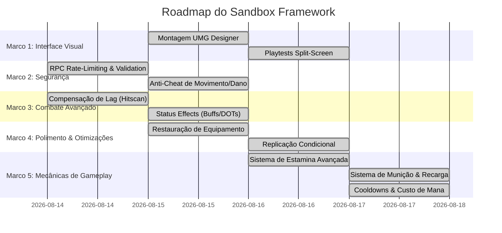

# Linha do Tempo e Roadmap - Sandbox Framework

Este documento apresenta o histórico detalhado do desenvolvimento do **Sandbox Framework** (Linha do Tempo) e planeja a progressão lógica e priorizada das entregas futuras (Roadmap).

---

## 📅 Linha do Tempo (Histórico de Desenvolvimento)

Abaixo está o registro de progresso do projeto físico em `D:\Unreal\V1` e sua integração com `D:\Unreal\GameAnimationSample`.

### 🏁 Fase de Fundação (Fases 1 a 9)
*   **Foco**: Configuração básica de diretórios e injeção por dados.
*   **Resultados**:
    *   Criação dos plugins de fundação (`01_SandboxCommon`, `02_SandboxInterfaces`, `03_SandboxAssets`, `04_SandboxCore`).
    *   Implementação do gerenciamento dinâmico de carregamento assíncrono via `USBAssetManager`.
    *   Injeção dinâmica de componentes via `USBPawnData` e `USBComponentFactory`.

### 🏃 Fase de Locomoção Preditiva (Fases 10 a 11)
*   **Foco**: Locomoção física replicada com compensação de rede.
*   **Resultados**:
    *   Criação de `05_SandboxCharacter`.
    *   Implementação de locomoção com compensação de rollback de rede para Sprint e Crouch rodando no Tick Group `TG_PrePhysics`.
    *   Criação de suíte de testes de estresse de rede.

### ⚔️ Fase de Combate e Atributos (Fases 12 a 14)
*   **Foco**: Combate desacoplado e atributos com modificadores.
*   **Resultados**:
    *   Criação de `06_SandboxCombat`.
    *   Implementação de atributos (Vida, Mana) com regeneração e modificadores dinâmicos acumulados (Overrides, Aditivos, Multiplicativos).
    *   Implementação de armas com disparos hitscan e projéteis físicos.

### 📦 Fase de Interação e Inventário (Fases 15 a 16)
*   **Foco**: Persistência física, foco/hold e mochila lógica.
*   **Resultados**:
    *   Criação de `07_SandboxInteraction` e `08_SandboxInventory`.
    *   Implementação de interações físicas (foco síncrono e segurar tecla com progresso no viewport).
    *   Mochila de itens replicada com suporte a stacking, desequipamento e fragments lógicos.
    *   **Correção Crítica**: Proteção de race conditions no roubo de itens simultâneo (Loot Dispute).

### 💾 Fase de Persistência e UI Dinâmica (Fases 17 a 18)
*   **Foco**: Save Game e barramento assíncrono de eventos de UI.
*   **Resultados**:
    *   Implementação do `USBSaveSubsystem` gravando e carregando binários de atores baseados em prioridades (`ISBSaveInterface`).
    *   Criação de `09_SandboxUI` e `10_SandboxDebug`.
    *   Implementação do barramento assíncrono idempotente e auto-unsubscribe recursivo no `NativeDestruct()` dos widgets para evitar Use-After-Free.

### 🚀 Fase de Portabilidade e Integração Híbrida (Fase 19)
*   **Foco**: Backing classes C++, portabilidade no `GameAnimationSample` e sincronização git.
*   **Resultados**:
    *   Desenvolvimento de classes C++ backing de UI (`USBStatusHUDWidget`, etc.) com guards de nulidade (Cast Failed) e filtros locais de viewport (anti-spill).
    *   Conversão do projeto `GameAnimationSample` para projeto C++ nativo e compilação de 241 módulos vinculados de forma estática.
    *   Sincronização git limpa com repositório remoto.

### 🔒 Fase de Segurança de Rede (Fase 20 - Concluída)
*   **Foco**: RPC Rate-Limiting & Server Validations autoritativas.
*   **Resultados**:
    *   Implementação de rate limiter genérico `FSBRPCRateLimiter` em `04_SandboxCore`.
    *   Validação geométrica 3D de alcance para interações físicas.
    *   Validação de posse de tags de habilidade no servidor e rate-limiting de ativação.
    *   Suíte de testes de automação ampliada com specs de anti-cheat e rate limit passadas com 100% de sucesso.

### ⚡ Fase de Compensação de Lag (Fase 21 - Concluída)
*   **Foco**: Network Rewind / Backtracking para disparos hitscan em redes latentes.
*   **Resultados**:
    *   Criado o subsistema de mundo C++ `USBLagCompensationSubsystem` em `04_SandboxCore` herdando de `FTickableGameObject` para salvar e limpar buffers de posições a cada frame (limite de 1.0s de histórico).
    *   Integrado backtracking no trace de armas hitscan (`PerformHitscanTrace` de `USBWeaponBehaviorHitscan`) calculando o delay do PING e limitando a compensação a 500ms por segurança.
    *   Criada suíte de testes de automação em `SBLagCompensationTests.cpp` cobrindo o record síncrono, interpolação de posições no passado, rebobinamento físico via `ETeleportType::TeleportPhysics` e posterior restauração de transforms. Todos os testes passaram com 100% de sucesso.

### 🧪 Fase de Status Effects (Fase 22 - Concluída)
*   **Foco**: Sistema genérico e replicado de Buffs, Debuffs, DOTs e HOTs.
*   **Resultados**:
    *   Criado o Data Asset estático `USBStatusEffectDefinition` em `05_SandboxCharacter` permitindo a especificação flexível de atributos a modificar, tags a conceder e ticks periódicos de alteração de atributos.
    *   Criado o componente gerenciador `USBStatusEffectComponent` implementando replicação via `FFastArraySerializer`, aplicação com renovação de duração, ticks periódicos no servidor (`TickComponent`) e limpeza de tags e modificadores no término do efeito.
    *   Implementada suíte de testes unitários em `SBStatusEffectTests.cpp` cobrindo buffs permanentes de velocidade, expiração automática de debuffs lentos e ticks de dano por veneno (DOT). Todos os testes passados com 100% de cobertura verde.

### 🎭 Fase de Sincronização Estética de Equipamento (Fase 23 - Concluída)
*   **Foco**: Restauração visual e acoplamento físico de armas nos sockets do esqueleto de forma replicada em rede.
*   **Resultados**:
    *   Estendida a classe `USBWeaponBehaviorDefinition` para incluir a classe do ator visual (`WeaponActorClass`), o socket ativo (`ActiveSocketName`) e o socket de coldre (`HolsterSocketName`).
    *   Atualizado o componente `USBCombatComponent` para gerenciar a lista replicada de armas spawnadas (`SpawnedWeapons`), manipulando o spawn dinâmico no servidor durante o carregamento estático (`LoadCombatConfig`) ou dinâmico por eventos (`OnItemEquipped`), além da destruição e reanexação dinâmica.
    *   Integrado o saque automático (mão) no `Enter` e guarda no coldre (holster) no `Exit` dos comportamentos de armas em `USBWeaponBehavior`.
    *   Criada a suíte de testes `SBWeaponVisualTests.cpp` validando o spawn síncrono de atores visuais (`AStaticMeshActor`), a anexação inicial correta no coldre, a transposição dinâmica para a mão do jogador ao disparar e a destruição limpa do ator no shutdown. 100% verde.

### 🔒 Fase de Anti-Cheat Avançado de Movimento e Dano (Fase 24 - Concluída)
*   **Foco**: Detecção de speedhack/teleporte no servidor com rollback, e proteção wall-shot.
*   **Resultados**:
    *   Implementado detector frame-perfect de deslocamento 2D no `USBMovementComponent::TickComponent` no servidor com rollback instantâneo (`TeleportTo`) para a última posição autorizada (`LastValidatedLocation`).
    *   Adicionado mecanismo de `AuthorizeServerRelocation()` para evitar falsos positivos em teleportes lícitos.
    *   Criada barreira física de validação de visibilidade no `USBWeaponBehaviorHitscan` rejeitando danos através de geometrias estáticas.
    *   Criada suíte `SBAntiCheatTests.cpp` com 100% de sucesso.

### ⚡ Fase de Otimização de Replicação e Atributos Condicionais (Fase 25 - Concluída)
*   **Foco**: Divisão de canais públicos/privados de atributos (`COND_OwnerOnly`) para salvar banda de rede.
*   **Resultados**:
    *   Reestruturado `USBAttributeComponent` dividindo `ReplicatedAttributes` em `PublicAttributes` e `PrivateAttributes`.
    *   Propriedades privadas de interesse individual (Mana, Stamina, Munição, XP) replicadas com a condição estrita `COND_OwnerOnly` para poupar rede e evitar exploits de leitura de dados inimigos.
    *   Criada suíte `SBConditionalReplicationTests.cpp` validando classificação e roteamento correto de canais. 100% verde.

### 🔋 Fase de Recursos Físicos e Mecânicas de Combate (Fases 27 a 30 - Concluídas)
*   **Foco**: Mecânicas críticas de gameplay (Estamina, Munição, Mana) integradas com predição local, cooldowns estruturados e playtests.
*   **Resultados**:
    *   **Fase 27 (Estamina Avançada)**: Implementado `Attribute.Stamina` privado, consumo predito ao sprintar/saltar e tag de exaustão (`State.Character.Exhausted`).
    *   **Fase 28 (Vinculação de Assets Visuais e Playtests de UI)**: Corrigido o bug polimórfico de cast de payloads de inventário, estendidas backing classes HUD e blindada a HUD contra vazamentos de rede (UI Spill) em Split-Screen.
    *   **Fase 29 (Sistema de Munição e Recarga)**: Registrado `Attribute.Weapon.Ammo` privado, implementado comportamento genérico de recarga `USBWeaponBehaviorReload` com duração de 2s e bloqueio de disparos via tags.
    *   **Fase 30 (Cooldowns de Habilidade e Custo de Mana)**: Integrado `Attribute.Mana` com taxa de regeneração de `5.f/s` e delay de `2.0s`, aplicação automática de `CooldownTag` e rollback transacional de rede.
    *   **Suíte de Testes**: Ampliada para **53 especificações 100% verdes**.

---

## 🗺️ Roadmap (Planejamento Estratégico de Próximas Fases)

Seguindo a ordem de prioridades estabelecida, dividimos o planejamento futuro em marcos lógicos de entrega.

### 🏆 Marco 1: Montagem Visual & Playtests de Interface (Frente 1: Widgets) - CONCLUÍDO
*   **Objetivo**: Visualizar na tela do editor todos os fluxos lógicos e de rede que validamos via testes unitários.
*   **Entregas**:
    *   Criação visual de Widget Blueprints herdando de `USBStatusHUDWidget`, `USBAbilityBarWidget`, `USBInteractionPromptWidget` e `USBInventoryGridWidget`.
    *   Estilização estética dos elementos (ProgressBar de vida/mana, máscara de cooldown da hotbar, prompt centralizado e popups de itens).
    *   Playtests detalhados em Listen Server (Single-Player) e Split-Screen local com 2 jogadores para certificar que o filtro anti-spill está funcionando sem vazamento de dados.

### 🛡️ Marco 2: Segurança & Validações de Rede (Frente 2) - CONCLUÍDO
*   **Objetivo**: Blindar a comunicação de rede contra ataques e spam de requisições de clientes maliciosos.
*   **Entregas**:
    *   Implementação de limitador de requisições (Rate-Limiting) para chamadas de RPCs cruciais (como `ServerTryActivateAbility` ou `ServerRemoveItem`).
    *   Validação de alcance física no servidor: confirmar se o Pawn do cliente está a uma distância de interação válida do baú/item no frame exato da chamada de RPC.
    *   Validação lógica de inventário no servidor: certificar que o jogador possui o item que está tentando equipar, consumir ou descartar.

### ⚡ Marco 3: Compensação de Lag & Status Effects (Frente 3) - CONCLUÍDO
*   **Objetivo**: Melhorar a experiência em rede latente (PING alto) e criar variedade de atributos temporários.
*   **Entregas**:
    *   **Compensação de Lag (Rewind de Rede)**: Salvar buffers de posicionamento de personagens no servidor para rebobinar o tempo no frame exato em que o cliente relatar um disparo hitscan, garantindo registro preciso de acertos.
    *   **Sistema de Status Effects**: Implementação de efeitos dinâmicos de buff e debuff temporários (ex: lentidão, dano ao longo do tempo - DOT, regeneração rápida de atributos).

### 🎨 Marco 4: Sincronização Estética de Equipamento (Polimento) - CONCLUÍDO
*   **Objetivo**: Garantir que as alterações lógicas de inventário sejam refletidas na malha visual 3D do personagem.
*   **Entregas**:
    *   Spawn de atores visuais correspondentes às armas e equipamentos vinculados a soquetes específicos da malha do personagem (Skeletal Mesh sockets).
    *   Restauração visual dos equipamentos no corpo do personagem ao carregar uma sessão de Save Game salva anteriormente.

### 🔋 Marco 5: Mecânicas de Gameplay Avançadas - CONCLUÍDO
*   **Objetivo**: Implementação das mecânicas fundamentais e preditas de locomoção e combate.
*   **Entregas**:
    *   **Estamina Avançada**: Consumo ao correr/pular e controle do estado de fadiga.
    *   **Munição & Recarga**: Consumo de balas, estado de recarregando e predição local.
    *   **Cooldowns & Custo de Mana**: Bloqueio de ativação e regeneração passiva de recursos.
