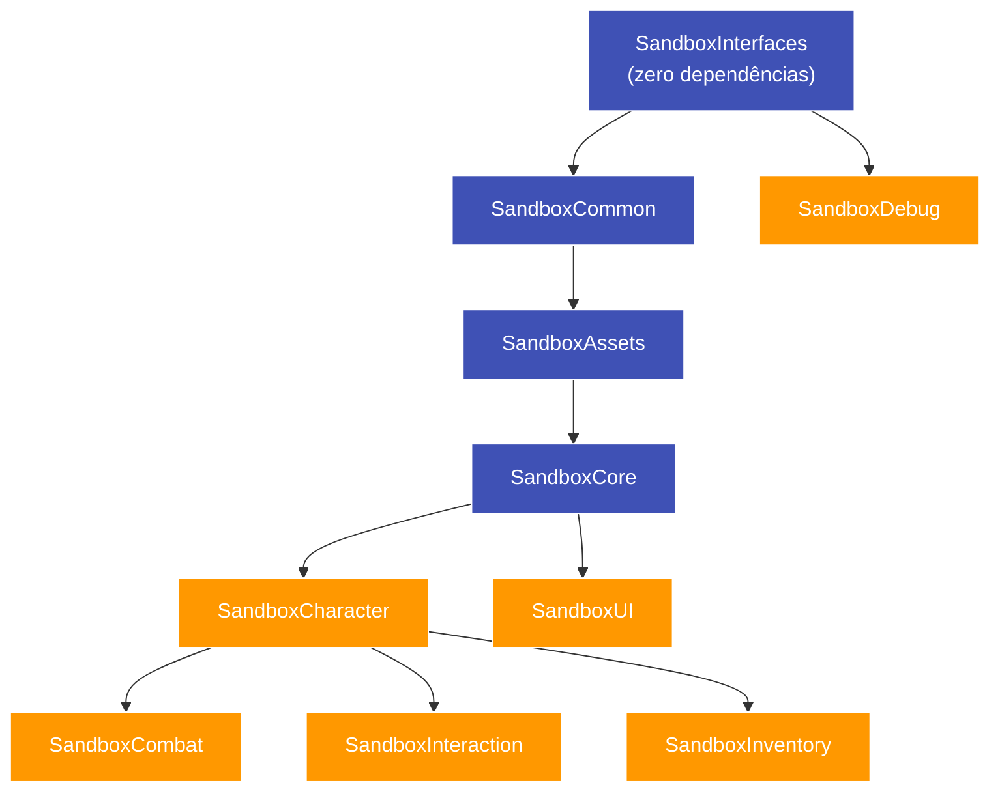

# 🧩 Plano — Vender o Framework como Vários Produtos Separados

**Levantado em**: 06/09/2026, extraindo o grafo de dependências dos 11 `.uplugin` e `Build.cs`.
**Decisão do usuário**: manter os plugins separados, como produtos independentes na Fab.

Este documento substitui a recomendação de consolidação do
[[plano_plugin_distribuivel]] §B2. O resto daquele documento (testes, conteúdo, `LogTemp`,
metadados, licença de asset) continua valendo **igual, para cada produto**.

---

## 1. O bloqueador que precisa ser resolvido primeiro

> [!DANGER] Produtos não podem embutir a fundação
> A tentação natural é fazer cada produto autossuficiente, embutindo `SandboxCommon`,
> `SandboxInterfaces` etc. dentro dele. **Isso quebra na hora em que o cliente instala dois
> produtos seus.**
>
> Dois plugins que declaram um módulo com o mesmo nome resultam em erro do UnrealBuildTool. O
> cliente que comprar Combate e Inventário juntos não consegue compilar — e vai abrir chamado
> dizendo que seus plugins são incompatíveis entre si.

**Consequência**: a fundação **tem** de ser um plugin único e compartilhado, do qual os demais
dependem. Não há alternativa técnica.

---

## 2. O grafo real de dependências

Extraído dos `Build.cs`, que é o que o compilador impõe:



| Módulo | Depende de | Leitura comercial |
| :--- | :--- | :--- |
| `SandboxInterfaces` | — | Raiz. Sem valor isolado |
| `SandboxCommon` | Interfaces | Sem valor isolado |
| `SandboxAssets` | Common, Interfaces | Sem valor isolado |
| `SandboxCore` | Assets, Common, Interfaces | Subsistemas — tem valor, mas ninguém compra sozinho |
| `SandboxCharacter` | Core + fundação | **Dependência de 3 dos 4 produtos de gameplay** |
| `SandboxCombat` | Character + fundação | Produto |
| `SandboxInteraction` | Character + fundação | Produto |
| `SandboxInventory` | Character + fundação | Produto |
| `SandboxUI` | Core + fundação — **não precisa de Character** | Produto mais independente |
| `SandboxDebug` | **só Interfaces** | O mais independente de todos |
| `SandboxEditor` | quase tudo | Ferramenta, acompanha |

**Dois achados que mudam o recorte:**

1. **`SandboxUI` não depende de `SandboxCharacter`.** Pode ser vendido a quem não compra o
   sistema de personagem — é o produto de entrada mais fácil.
2. **`SandboxDebug` depende só de `Interfaces`.** É praticamente autônomo: ferramenta de debug
   visual que serve a qualquer projeto, com dependência mínima.

---

## 3. Recorte proposto

### Produto 0 — `SandboxFrameworkCore` · **gratuito**

`SandboxInterfaces` + `SandboxCommon` + `SandboxAssets` + `SandboxCore`

**Por que gratuito**: ninguém compra "tipos compartilhados e interfaces". Se for pago, vira
barreira na entrada de **todos** os outros produtos. Sendo gratuito, ele é o canal de aquisição:
quem instala conhece a qualidade e vira comprador dos módulos pagos.

Não é pouca coisa — leva os subsistemas do `SandboxCore`: persistência, eventos, save,
particionamento espacial, LOD temporal, compensação de lag, profiler.

> **Alternativa**: cobrar barato pelo Core e deixar só `Interfaces`+`Common`+`Assets` grátis.
> Pior negócio: divide a fundação em duas instalações e a fundação em si não vende sozinha.

### Produtos pagos

| Produto | Módulos | Requer | Argumento |
| :--- | :--- | :--- | :--- |
| **Sandbox Character** | `SandboxCharacter` | Core | Atributos replicados, estado por tags, movimento preditivo, habilidades, efeitos de status |
| **Sandbox Combat** | `SandboxCombat` | Core + **Character** | Armas, agro, IA com StateTree e Smart Objects, parry, lock-on, execuções |
| **Sandbox Inventory** | `SandboxInventory` | Core + **Character** | Inventário replicado à prova de race condition, crafting, loot, construção |
| **Sandbox Interaction** | `SandboxInteraction` | Core + **Character** | Interação por foco e hold, sincronizada em rede |
| **Sandbox UI** | `SandboxUI` | Core | Backing classes C++ de UI, gerenciador por camadas, filtro de escopo local |
| **Sandbox Debug** | `SandboxDebug` | *(quase nada)* | Overlay de debug visual — entrada barata |

### A decisão comercial que o grafo impõe

Três dos quatro produtos de gameplay exigem **Character**. Quem quiser só combate compra dois
produtos pagos.

**Duas saídas, e a escolha é sua:**

| Opção | O que muda | Custo |
| :--- | :--- | :--- |
| **(a)** Character continua pago | Cada produto de gameplay custa 2 compras | Atrito na venda, mas Character se paga como produto |
| **(b)** Character entra no Core gratuito | Combat/Inventory/Interaction viram compra única | Você dá de graça o sistema de personagem — que é dos mais trabalhosos |

Minha leitura: **(b) vende mais no agregado.** O sistema de personagem sozinho compete com
dezenas de plugins de atributos; combate, inventário e interação em cima de uma fundação testada
é o que não tem equivalente. Mas isso é chute comercial meu, e você conhece o mercado — o dado
duro é só que o grafo obriga a escolher.

---

## 4. Compatibilidade entre versões: o risco de vender separado

Vender junto, tudo sobe na mesma versão. Vender separado, o cliente pode ter **Core 1.2 com
Combat 1.0**. Se o Core mudar uma assinatura, o build do cliente quebra e a culpa cai em você.

O projeto **já tem a infraestrutura para isso** e não usa. Todos os `.uplugin` trazem:

```json
"SandboxVersion": {
    "Plugin": "1.0.0",
    "API": 1,
    "Assets": 1,
    "Network": 1,
    "Serialization": 1
}
```

No [[plano_plugin_distribuivel]] §B6 sugeri remover isso por não ser padrão da Unreal. **Com
produtos separados, ele passa a ser essencial** — retiro a sugestão.

**Disciplina mínima:**

| Regra | Consequência |
| :--- | :--- |
| Mudou assinatura pública do Core → `API` +1 | Produtos com `API` anterior precisam de atualização |
| Mudou formato de save → `Serialization` +1 | Saves antigos exigem migração |
| Mudou replicação → `Network` +1 | Cliente e servidor de versões diferentes não conversam |
| Cada produto declara o `API` mínimo que exige | Verificável no carregamento |

**Falta código para isso**: uma checagem no start do módulo comparando o `API` que o produto
exige com o que o Core oferece, falhando com mensagem clara em vez de erro de link. É pouco
código e evita a pior classe de chamado de suporte.

---

## 5. O que multiplica por produto

Cada item do [[plano_plugin_distribuivel]] passa a ser feito **seis ou sete vezes**:

| Item | Vezes | Observação |
| :--- | :-: | :--- |
| Guardar testes com `WITH_DEV_AUTOMATION_TESTS` | 1× | Mecânico, faz-se em todos de uma vez |
| Renomear removendo prefixo numérico | 7× | `01_SandboxCommon` → `SandboxFrameworkCore` etc. |
| Metadados do `.uplugin` | 7× | URLs, categoria, plataformas |
| Pasta `Content/` com exemplos | 7× | **O mais caro** — cada produto precisa demonstrar o próprio valor |
| Documentação em inglês | 7× | Cada produto com guia próprio |
| Mapa de demonstração | 7× | Ou um por produto, ou um compartilhado no Core gratuito |
| Suíte verde por produto | 7× | Ver §6 |

> [!WARNING] O custo real de vender separado não é técnico
> Tecnicamente é quase o mesmo trabalho. O que multiplica é **documentação, exemplo e
> suporte** — e isso é o que consome tempo depois do lançamento. Sete produtos são sete páginas
> de FAQ, sete conjuntos de reviews e sete filas de dúvida sobre "por que não compila" (resposta:
> falta o Core).

---

## 6. Os testes, com produtos separados

Os 446 specs hoje rodam como uma suíte só, no projeto inteiro. Vendidos em separado, o comprador
de Combat deveria conseguir rodar **os testes de Combat** na instalação dele.

Os testes já vivem dentro do módulo que testam (`SBCombatTests.cpp` em `06_SandboxCombat`), e os
nomes já têm prefixo por área — `Sandbox.Combat.*`, `Sandbox.Inventory.*`. Então:

```
Automation RunTest Sandbox.Combat
```

já funciona por produto. **É um argumento de venda forte e raro**: "instale e rode a suíte do
plugin no seu projeto". Vale destacar na página do produto.

Uma checagem antes de anunciar: confirmar que os testes de cada módulo passam **sem** os módulos
que não são dependência dele. Hoje eles sempre rodam com tudo carregado, então isso não está
verificado.

---

## 7. Ordem recomendada

| # | Etapa | Por quê |
| :-: | :--- | :--- |
| 1 | Guardar os 112 arquivos de teste | Independente, baixo risco, vale para todos |
| 2 | Decidir (a) ou (b) do §3 | Define o recorte antes de renomear qualquer coisa |
| 3 | Renomear os plugins sem prefixo numérico | Nome de produto é permanente após publicar |
| 4 | Checagem de versão de API entre produtos (§4) | Antes do primeiro lançamento, não depois |
| 5 | Lançar **um** produto primeiro | Aprender o processo de revisão da Epic com o de menor risco |
| 6 | Os demais | Com o processo já conhecido |

**Sugestão para o passo 5**: `SandboxFrameworkCore` (gratuito) e, logo depois, **Sandbox
Debug** — que depende só de `Interfaces`, é o mais simples de empacotar e testa todo o pipeline
de submissão com o menor risco. Errar na revisão de um produto gratuito e simples custa tempo;
errar no carro-chefe custa reputação.

---

## 8. O que continua valendo do plano anterior

Tudo que não é o recorte:

- **B1** — testes em módulos Runtime sem guarda: continua sendo o bloqueador nº 1
- **B3** — plugins sem `Content/`: agora é **por produto**
- **B4** — `LogTemp` em 9 arquivos
- **B5** — metadados vazios: agora **7 vezes**
- **Licença de asset**: `DA_HeroPawnData` referencia `SKM_UEFN_Mannequin` e
  `SandboxCharacter_Mover_ABP`, conteúdo do Game Animation Sample da Epic. **Não pode ser
  redistribuído em produto pago.** Continua sendo o risco mais sério da lista
