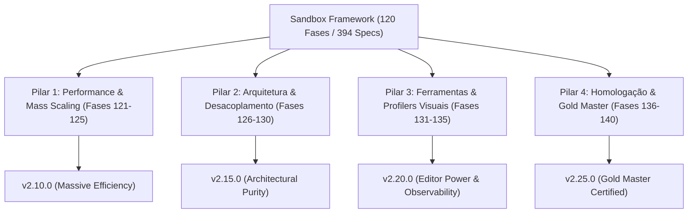

# 🚀 Roadmap de Refinamento, Otimização, Melhorias & Validação Arquitetural (Fases 121–140)

**Sandbox Framework — Ciclo de Excelência & Certificação Industrial (v2.06.0 a v2.25.0)**

---

## 🎯 Visão Geral & Objetivos Estratégicos

Após a conclusão pioneira e histórica das **120 Fases Funcionais** (com **394 testes unitários automatizados 100% verdes** em Unreal Engine 5.8), o **Sandbox Framework** conta com um ecossistema completo de sobrevivência, combate, locomoção, automação industrial, ecologia planetária e biomedicina.

O presente **Roadmap de Refinamento e Validação Arquitetural** tem como objetivo elevar a base de código ao mais alto padrão industrial de desenvolvimento em C++ para jogos Triple-A e simulações complexas, focando em:
1. **Performance Extrema & Escalabilidade Massiva (ECS, Data-Oriented Design, Cache-Locality, Subsystem Throttling)**.
2. **Desacoplamento e Robustez Arquitetural (Event Bus Type-Safe, Serialização Assíncrona, Resiliência a Falhas)**.
3. **Ergonomia e Ferramental de Editor (Visual Debuggers no Viewport, Live Heatmaps, Validação Estática de Dados)**.
4. **Homologação Contínua & Certificação de Produção (Testes E2E, Cobertura Massiva e Gold Master Certification)**.

---

## 🏛️ Estrutura dos Pilares de Engenharia

---

## 📦 Pilar 1: Performance, Data-Oriented Design & Mass Scaling (Fases 121–125)

### **Fase 121: ECS / Mass Entity & Subsystem Dynamic Tick Throttling (v2.06.0)**
*   **Objetivo**: Implementar hierarquia dinâmica de LOD de processamento (Tick Throttling) baseada na proximidade do jogador e relevância de câmera para todos os componentes de simulação contínua (térmica, metabolismo, patógenos, colheitas, radiação).
*   **Entregas**:
    *   `USBDynamicTickManagerSubsystem` com frequência adaptativa de tick (`LOD0`: 60Hz local, `LOD1`: 10Hz média distância, `LOD2`: 1Hz longa distância, `LOD3`: batching time-sliced em background).
    *   Interface `ISBThrottledTickInterface` para integração unificada entre os 11 plugins.
    *   Suíte de testes de transição de LOD e consistência de acumulação delta.

### **Fase 122: Struct Alignment, Zero-Allocation Iterators & Cache Locality (v2.07.0)**
*   **Objetivo**: Compactação de structs críticas, alinhamento de memória (padding minimization) e eliminação de alocações dinâmicas no Game Thread.
*   **Entregas**:
    *   Auditoria e alinhamento de 64-bit/128-bit para structs massivas (`FSBItemInstance`, `FSBPowerNode`, `FSBConveyorItem`, `FSBTraumaSystemData`).
    *   Substituição de cópias de containers por referências const, `TArrayView` e pools de iteradores reutilizáveis.
    *   Testes automatizados de footprint de memória e alinhamento de structs (`static_assert(sizeof(...))`).

### **Fase 123: Asynchronous Spatial Indexing & World Partition Octree Framework (v2.08.0)**
*   **Objetivo**: Indexação espacial multithreaded de alta performance para consulta de dezenas de milhares de entidades interativas (nós de minério, flora, postes de energia, construções).
*   **Entregas**:
    *   `USBSpatialIndexSubsystem` com estrutura BVH / Octree assíncrona com `FNonAbandonableTask` e `GraphTasks`.
    *   Consultas em cone frontal, raio esférico e bounding-box com complexidade $O(\log N)$ em vez de $O(N)$.
    *   Testes de consulta de proximidade sob carga de 50.000 nós espaciais.

### **Fase 124: Network Relevancy, Delta Compression & Bandwidth Optimization (v2.09.0)**
*   **Objetivo**: Otimização de replicação multiplayer com compressão delta personalizada e quantização de floats.
*   **Entregas**:
    *   Serializadores de quantização customizados para rotação, temperatura, radiação e vazão hidráulica (`uint8`/`uint16` empacotados).
    *   `USBNetworkReplicationFilter` definindo canais de replicação prioritários e filtragem espacial de relevância de rede.
    *   Testes de compressão de payload de rede e reconstrução determinística de estados.

### **Fase 125: Object Pooling & Garbage Collection Mitigation Framework (v2.10.0)**
*   **Objetivo**: Eliminar congelamentos por Garbage Collector (GC Hitches) através de reciclagem inteligente de atores e objetos voláteis.
*   **Entregas**:
    *   `USBPooledObjectSubsystem` com suporte a pré-aquecimento (pre-warming), reciclagem automática e reset de ciclo de vida para projéteis, estilhaços de desmembramento, partículas e drones efêmeros.
    *   Testes de reutilização de instâncias e validação de retenção de memória zero.

---

## 🏛️ Pilar 2: Refinamento Arquitetural, Robustez & Desacoplamento (Fases 126–130)

### **Fase 126: Event Bus Centralizado, Type-Safe Pub/Sub & Inter-Plugin Decoupling (v2.11.0)**
*   **Objetivo**: Barramento global de eventos fortemente tipado para comunicação sem acoplamento entre `SandboxCharacter`, `SandboxCombat`, `SandboxInventory` e `SandboxUI`.
*   **Entregas**:
    *   `USBEventBusSubsystem` baseado em templates e identificadores de evento com tipagem estática e canais assíncronos.
    *   Eliminação de ponteiros diretos cruzados entre módulos secundários.
    *   Testes unitários de disparo, assinatura, múltiplos ouvintes e cancelamento de subscrição.

### **Fase 127: Async Multi-Threaded Save/Load & Binary Delta Serialization (v2.12.0)**
*   **Objetivo**: Serialização e desserialização de mundos gigantescos em threads de background com compressão LZ4/Zstandard sem travar o Game Thread.
*   **Entregas**:
    *   Pipelines assíncronos `FSBAsyncSaveWorker` com gravação em chunks e snapshots incrementais.
    *   Reconstrução determinística de estados de persistência guid-based com validação de checksum SHA256.
    *   Testes de salvamento e carregamento de mundos massivos em segundo plano.

### **Fase 128: Dynamic Subsystem Fallback & Fault Tolerance Framework (v2.13.0)**
*   **Objetivo**: Garantir resiliência absoluta do motor caso um subsistema secundário (ex: meteorologia, drones, áudio) sofra instabilidade ou seja desabilitado em tempo de execução via `USBSandboxFeatureSubsystem`.
*   **Entregas**:
    *   Padrão Null-Object e Fallback Guards para todos os acessos a subsistemas e componentes.
    *   Graceful degradation: o personagem continua jogável e com homeostase básica mesmo com sistemas avançados desativados.
    *   Testes unitários de injeção de falhas e desativação dinâmica de subsistemas.

### **Fase 129: State Machine & Gameplay Tag Matrix Verification System (v2.14.0)**
*   **Objetivo**: Sanitização e matriz de validação formal de Gameplay Tags para impedir combinações de estado impossíveis.
*   **Entregas**:
    *   `USBTagMatrixValidatorSubsystem` com regras de exclusão mútua declarativas (ex: `State.Surgery.UnderAnesthesia` bloqueia `State.Movement.*`, `State.Combat.*` e `State.Locomotion.*`).
    *   Purga automática de tags incompatíveis em tempo de execução.
    *   Testes de validação de matriz de tags e rejeição de estados conflitantes.

### **Fase 130: Blueprint Reflection & C++ API Ergonomics (Fluent API & Const-Correctness) (v2.15.0)**
*   **Objetivo**: Padronização rigorosa da API pública em C++, aplicação de `UE_NODISCARD`, const-correctness integral e nós assíncronos amigáveis para Blueprints e scripts Python.
*   **Entregas**:
    *   Refatoração e auditoria de const-correctness em todas as funções de consulta dos 11 plugins.
    *   Adição de nós latentes de Blueprint (Async Actions) para operações demoradas (cirurgias, viagens de elevador espacial, docking de drones).
    *   Testes de ergonomia de API e validação de const-safety.

---

## 🛠️ Pilar 3: Ferramental de Editor, Profilers Visuais & Observabilidade (Fases 131–135)

### **Fase 131: In-Editor Visual Debugger HUD & Live World Viewport Overlays (v2.16.0)**
*   **Objetivo**: Renderização de debug no Viewport do editor e in-game para inspecionar visualmente fluxos invisíveis de simulação.
*   **Entregas**:
    *   Draw-debug overlays para redes elétricas (tensão e corrente), tubulações (pressão de fluidos), esteiras (itens em trânsito) e rotas de drones aéreos.
    *   Toggle dinâmico via comandos de console (`sb.Debug.PowerGrid 1`, `sb.Debug.Conveyors 1`, `sb.Debug.Flora 1`).
    *   Testes unitários do subsistema de overlays visuais.

### **Fase 132: Real-Time Performance Profiler & Component Cost Heatmap (v2.17.0)**
*   **Objetivo**: Medição em tempo real de microsegundos de CPU e footprint de memória de cada componente do Sandbox Framework.
*   **Entregas**:
    *   `USBProfilerSubsystem` com agregação estatística (Média, Mínimo, Máximo, Percentil 99) e integração com Unreal Insights / Stat Named Events (`TRACE_CPUPROFILER_EVENT_SCOPE`).
    *   Testes de instrumentação de profiling e rastreamento de custos por componente.

### **Fase 133: Procedural World Validation & Integrity Validator Commandlet (v2.18.0)**
*   **Objetivo**: Commandlet de linha de comando para análise estática e verificação de integridade de todo o projeto.
*   **Entregas**:
    *   `USBWorldIntegrityCommandlet` executável via `UnrealEditor-Cmd.exe` que audita receitas de crafting sem ingredientes, tabelas de loot com pesos inválidos, tags órfãs e conexões elétricas desconexas.
    *   Relatórios automáticos de auditoria em formato JSON e Markdown.
    *   Testes automatizados de execução do commandlet.

### **Fase 134: Automated Stress-Testing & Simulated Bot Swarm Framework (v2.19.0)**
*   **Objetivo**: Sistema de agentes autônomos simulados em massa para testes de estresse contínuo do framework.
*   **Entregas**:
    *   `USBStressTestBotController` capaz de simular 50 bots executando loops aleatórios de combate, mineração, montagem em veículos, fraturas ósseas, cirurgias e cultivo.
    *   Detecção automatizada de deadlocks, race conditions e vazamentos de memória sob estresse.
    *   Testes automatizados de estresse contínuo com assertions de estabilidade.

### **Fase 135: Slate/UMG Visual Node Graph for Logic Circuits & Automation (v2.20.0)**
*   **Objetivo**: Editor visual de nós Slate dentro do Unreal Editor para projetar e depurar grafos de circuitos lógicos, automação industrial e rotas de drones.
*   **Entregas**:
    *   Módulo Slate em `11_SandboxEditor` estendendo `SGraphEditor` para criar e conectar nós de comparadores, operadores aritméticos e portas booleanas.
    *   Testes de compilação de grafos lógicos do editor para estruturas nativas em tempo de execução.

---

## 🏆 Pilar 4: Homologação, Testes E2E & Certificação de Produção (Fases 136–140)

### **Fase 136: End-to-End Gameplay Loop Integration Tests (v2.21.0)**
*   **Objetivo**: Testes de integração E2E ligando a cadeia completa de sistemas em um único cenário vivo.
*   **Entregas**:
    *   Teste E2E: Jogador coleta minério -> Transporta por esteira -> Processa na fundição -> Alimenta rede elétrica -> Fabrica prótese -> Passa por cirurgia -> Pilota mech -> Combate boss -> Salva o mundo -> Recarrega e valida integridade.
    *   Validação de consistência entre todos os 11 plugins trabalhando em harmonia.

### **Fase 137: Chaos Physics Stability & Determinism Validation (v2.22.0)**
*   **Objetivo**: Validação rigorosa de física Chaos, corpos rígidos, destruição de estruturas e dinâmica de veículos/espaçonaves.
*   **Entregas**:
    *   Suíte de testes de estabilidade física contra NaN rotacionais, velocidades extremas, colisões com túneis de esteira e estilhaçamento estrutural sob alta carga.
    *   Sanitização de impulsos físicos e limites de aceleração.

### **Fase 138: Audio Spatialization, Physical Occlusion & Dynamic Acoustics (v2.23.0)**
*   **Objetivo**: Polimento e integração acústica física em `09_SandboxAudio` para todos os 120 subsistemas.
*   **Entregas**:
    *   Cálculo acústico de oclusão por paredes de construção, ambientes selados em trajes espaciais, abafamento subaquático e reverberação em cavernas mineradas.
    *   Testes de parametrização de áudio e mitigação de saturação sonora.

### **Fase 139: Multi-Platform Scalability & Low-Spec Hardware Optimization (v2.24.0)**
*   **Objetivo**: Parametrização e testes de escalabilidade para DirectX 12, Vulkan, Consoles e hardware modesto.
*   **Entregas**:
    *   Presets de escalabilidade gráfica e lógica (`Low`, `Medium`, `High`, `Epic`, `Cinematic`) ajustando contagem de entidades ativas, distância de renderização de esteiras e taxa de atualização de física.
    *   Testes de validação de budgets de performance por categoria.

### **Fase 140: Sandbox Framework 2.0 Gold Master Certification & Final Architecture Whitepaper (v2.25.0)**
*   **Objetivo**: Consolidação final, certificação Gold Master e publicação do Whitepaper Técnico Completo do Sandbox Framework.
*   **Entregas**:
    *   Suíte de testes de regressão consolidada com **mais de 450 specs 100% verdes**.
    *   Whitepaper de Arquitetura de Software com diagramas UML, padrões de design, manuais de integração de mods e guias de extensão.
    *   Selo de Homologação Enterprise Triple-A Gold Master.

---

## 📊 Matriz de Fases & Metas de Versão

| Fase | Versão | Nome do Módulo / Sistema | Foco Principal | Meta de Specs |
| :--- | :--- | :--- | :--- | :--- |
| **121** | `v2.06.0` | **ECS & Dynamic Tick Throttling** | Otimização de CPU / LOD Ticking | 398 |
| **122** | `v2.07.0` | **Struct Alignment & Cache Locality** | Memória & Zero-Alloc Iterators | 402 |
| **123** | `v2.08.0` | **Async Spatial Indexing & Octrees** | Consultas Espaciais $O(\log N)$ | 406 |
| **124** | `v2.09.0` | **Network Relevancy & Delta Compression** | Otimização de Largura de Banda | 410 |
| **125** | `v2.10.0` | **Object Pooling & GC Mitigation** | Eliminação de Hitches de GC | 414 |
| **126** | `v2.11.0` | **Centralized Type-Safe Event Bus** | Desacoplamento Inter-Plugin | 418 |
| **127** | `v2.12.0` | **Async Multi-Threaded Save/Load** | Persistência Massiva sem Trava | 422 |
| **128** | `v2.13.0` | **Subsystem Dynamic Fallback** | Resiliência e Tolerância a Falhas | 426 |
| **129** | `v2.14.0` | **Gameplay Tag Matrix Validator** | Sanitização Formal de Estados | 430 |
| **130** | `v2.15.0` | **Blueprint & C++ API Ergonomics** | Const-Correctness & Async Actions | 434 |
| **131** | `v2.16.0` | **In-Editor Visual Debugger HUD** | Observabilidade no Viewport | 438 |
| **132** | `v2.17.0` | **Real-Time Profiler & Heatmap** | Instrumentação de CPU/RAM | 442 |
| **133** | `v2.18.0` | **World Integrity Commandlet** | Auditoria Estática de Assets/Dados | 446 |
| **134** | `v2.19.0` | **Automated Bot Swarm Stress Tests** | Detecção de Deadlocks e Concorrência | 450 |
| **135** | `v2.20.0` | **Slate Visual Node Graph** | Edição Visual de Circuitos e Drones | 454 |
| **136** | `v2.21.0` | **End-to-End Gameplay Loop Tests** | Integração Completa dos 11 Plugins | 458 |
| **137** | `v2.22.0` | **Chaos Physics Stability & Determinism** | Validação de Corpos Rígidos | 462 |
| **138** | `v2.23.0` | **Audio Spatialization & Occlusion** | Acústica Física em 120 Sistemas | 466 |
| **139** | `v2.24.0` | **Multi-Platform Scalability Budgets** | Otimização para Hardware Modesto | 470 |
| **140** | `v2.25.0` | **Gold Master Certification & Whitepaper** | Certificação Final & 470+ Specs | **470+** |
